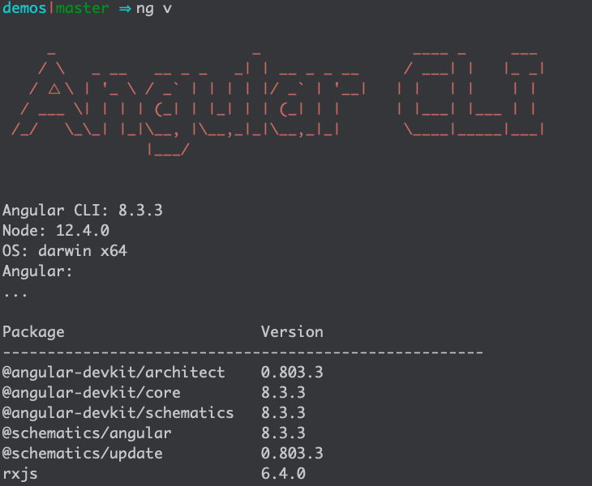
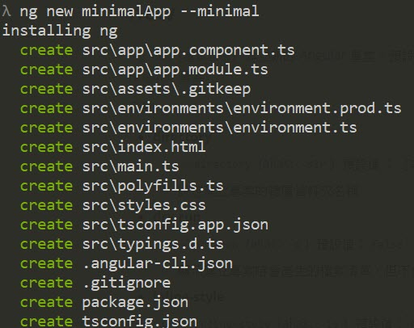
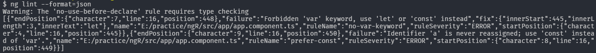
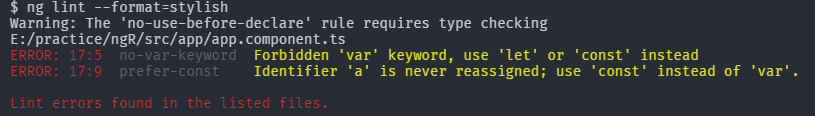
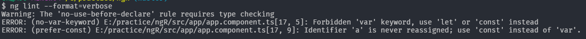
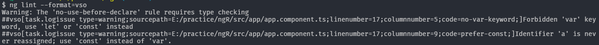
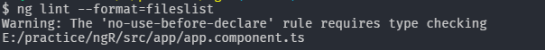

# Angular CLI

Angular CLI 是 Angular Team 與社群一起合作創造出來的工具，Angular CLI (以下簡稱為 CLI) 提供一系列的指令，讓開發者可以從建置專案、開發、測試、一直到部屬，都可以透過 CLI 的幫助下完成。


# 安裝篇

我們可以透過 `npm` 安裝 CLI，打開命令視窗輸入以下的指令 (windows/mac 皆適用)

> npm install -g @angular/cli


當安裝完成後，可以透過 `ng v` 的指令來檢查安裝的版本



當看到這個畫面時，就表示 Angular CLI 安裝成功了


# 指令篇

Angular CLI 的命令都需要透過 `ng` 使用

> ng <command>


## new

`ng new [專案名稱]` 建立新的 Angular 專案，預設會建立一個與專案名稱相同的資料夾，並在該資料夾內初始化 Angular 專案

### 參數

* **directory**

  * `--directory` (alias: `-dir`)  預設值 ： `[專案名稱]` 
  * 設定建立專案的隸屬資料夾名稱

* **dry-run**

  * `--dry-run` (alias: `-d`)  預設值：`false`
  * 顯示建立專案時會產生的檔案清單，但不會實際產生實體檔案

* **inline-style**

  * `--inline-style` (alias: `-is`)  預設值：`false`
  * 使用 `inline-style` 模式

* **inline-template**

  * `--inline-template` (alias: `-it`)  預設值：`false`
  * 使用 `inline-template` 模式

* **minimal**

  * `--minimal` 預設值：`false`

  * 產生最小單位的 Angular 專案

  * 最小單位的 Angular 專案結構

    

  * 完整的 Angular 專案架構

    

* **prefix**

  * `--prefix` (alias: `-p`)  預設值: app
  * 給 `component selector` 使用的前綴詞
  * 可事後由 `.angular-cli.json` 設定

* **routing**

  * `--routing`  預設值：`false`
  * 建立路由模組

* **skip-commit**

  * `--skip-commit` (alias: `-sc`)  預設值：`false`
  * 忽略第一次建立時的 git 簽入動作

* **skip-git**

  * `--skip-git` (alias: `-sg`) 預設值：`false`
  * 不建立 git Repository

* **skip-install**

  * `--skip-install` (alias: `-si`) *預設值：`false`*
  * 建立新專案時，不執行安裝套件動作 (install packages)

* **skip-test**

  * `--skip-tests (aliases: `-st) 預設值：`false`
  * 不建立 `spec` 測試檔案
  * 不包含 `e2e` 測試功能

* **source-dir**

  * `--source-dir` (alias: `-sd`) 預設值： src
  * 主專案程式存放的資料夾名稱
  * 可事後由 `.angular-cli.json` 設定 (app[0].root)

* **style**

  * `--style` 預設值：css
  * 支援以下格式
    * css
    * scss
    * less
    * sass
    * styl (stylus)
  * 可事後由 `.angular-cli.json` 設定 (defaults.styleExt)

* **verbose**

  * `--verbose` (alias: `-v`) 預設值：`false`
  * 顯示更多輸出資訊


## serve

`ng serve` 指令會進行專案建置並啟動網頁伺服器

可以搭配使用的參數說明如下

### 參數

* **host**
  * `--host` (aliases: `-H`) 預設值: localhost
  * 預設網址 localhost
* **hmr**
  * `—hmr` 預設值: false
  * 啟動模組熱拔插功能
* **live-reload**
  * `--live-reload` (aliases: `-lr`) 預設值: true
  * 使用 `live-reload` 監控異動，當有異動時則會重整畫面。
* **public-host**
  * `--public-host` (aliases: `--live-reload-client`)
  * 指定一個其他使用者可以瀏覽的網址。
* **disable-host-check**
  * `--disable-host-check`  預設值: false
  * 不檢查連線使用者連線是否來自允許的網域。
* **open**
  * `--open` (aliases: `-o`) 預設值: false
  * 在預設瀏覽器打開網址
* **port**
  * `--port` (aliases: `-p`) 預設值: 4200
  * 網站伺服器所使用的連接阜
* **ssl**
  * `--ssl`
  * 網站伺服器使用 `HTTPS`
* **ssl-cert**
  * `--ssl-cert` (aliases: `-`) 
  * 指定 SSL 憑證位置給網站伺服器使用
* **ssl-key**
  * `--ssl-key`
  * 指定 SSL 金鑰位置給網站伺服器使用
* **aot**
  * `--aot`
  * 使用 `AOT` 模式建置專案
* **base-href**
  * `--base-href` (aliases: `-bh`)
  * 設定 `<base>` 網址
* **deploy_url**
  * `--deploy-url` (aliases: `-d`)
  * 設定部署網址
* **environment**
  * `--environment` (aliases: `-e`)
  * 指定環境變數檔
* **extract-css**
  * `--extract-css` (aliases: `-ec`)
  * 是否將 `global style`內設定的 css 檔案建置為 css 檔案而非 js 檔案
* **i18n-file**
  * `--i18n-file`
  * 指定多國語系檔位置
* **i18n-format**
  * `--i18n-format`
  * 設定多國語系檔格式
* **locale**
  * `--locale`
  * 設定語系
* **output-hashing**
  * `--output-hashing` (aliases: `-oh`)
  * 設定輸出檔案檔名模式(cache-busting hashing mode)，可使用的參數如下
    * none
    * all
    * media
    * bundles
* **output-path**
  * `--output-path` (aliases: `-op`) 
  * 設定建置輸出位置
* **poll**
  * `--poll`
  * 設定檢查檔案異動頻率 (微秒)
  * 屬 webpack watchOptions 參數 (https://webpack.js.org/configuration/watch/#watchoptions)
* **progress**
  * `--progress` (aliases: `-pr`) 預設值: true
  * 顯示建置進度
* **sourcemap**
  * `--sourcemap` (aliases: `-sm`, `sourcemaps`)
  * 輸出 souremap
* **target**
  * `--target` (aliases: `-t`, `-dev`, `-prod`) 預設值: development
  * 設定建置模式 (development模式，production模式)
* **vendor-chunk**
  * `--vendor-chunk` (aliases: `-vc`) 預設值: true
  * 是否將 `vendor` 單獨建置成獨立的檔案
* **common-chunk**
  * `--common-chunk` (aliases: `-cc`) 預設值: true
  * 是否將重複性質的程式碼單獨建置成獨立的檔案
* **verbose**
  * `--verbose` (aliases: `-v`) 預設值: false
  * 是否要顯示更多的資訊
* **watch**
  * `--watch` (aliases: `-w`)
  * 當檔案異動時，重新建置專案

### 備註

當執行 `ng serve` 時，所有的過程都是在記憶體裡完成的，所以不會有實體檔案的輸出。


## generate

`ng generate [name]` 建立指定的藍圖範本

### 預設範本

* class
* component
* directive
* enum
* guard
* interface
* module
* pipe
* service

### 參數

* **dry-run**
  * `--dry-run` (aliases: `-d`) 預設值: false
  * 顯示會產生與異動的檔案內容，但不會真正的執行
* **lint-fix**
  * `--lint-fix` (aliases: `-lf`)
  * 在建立範本後使用 `lint` 修正樣式
  * 可於 `.angular-cli.json` 內設定為預設選項 (`defaults.lintFix`)。
* **verbose**
  * `--verbose` (aliases: `-v`) 預設值: false
  * 顯示更多輸出資訊
* **collection**
  * `--collection` (aliases: `-c`) 預設值 : @schematics/angular
  * 設定要使用的 `Schematics` 集合


## build

`ng build` 建置專案並輸出到資料夾

### 建置專案

> ng build

預設專案輸出的資料夾是 `dist/`。

所有建置或是服務命令 (`ng build/serve/e2e/`)，預設都會移除 `dist/` 資料夾，這行為可以透過 `--no-delete-output-path` 或 `--delete-output-path=false` 的參數停用

### 建置類型與環境變數檔案 (Build Targets and Environment Files)

`ng build` 可以預設可以指定兩種建置目標 ( `--target=production` 或 `--target=development`)，並且使用相對應的環境變數檔案 (`--environment=prod` 或 `--environment=dev`)。預設目標是 `development`

環境變數與建置目標的對應檔，可以在  `.angular-cli.json` 內找到

```json
"environmentSource": "environments/environment.ts",
"environments": {
  "dev": "environments/environment.ts",
  "prod": "environments/environment.prod.ts"
}
```

以下的使用的參數也適用於 `ng serve`，如果沒有特定指定，預設對應是 `dev` 對 `development`，`prod` 對 `production`。

```
# these are equivalent
ng build --target=production --environment=prod
ng build --prod --env=prod
ng build --prod
# and so are these
ng build --target=development --environment=dev
ng build --dev --e=dev
ng build --dev
ng build
```

當然，也可以自行新增環境變數及目標

* 建立 `src/environments/environment.NAME.ts` 檔案
* 於 `.angular-cli.json` 新增`{ "NAME": 'src/environments/environment.NAME.ts' }` 至 `apps[0].environments` 區塊內 。
* 在 `build/serve` 時可以過 `--env=Name` 參數設定來使用新增的環境變數

### Base Tag

`build` 提供方法 (`--base-href your-url`)可以從外部修改 `index.html` 的 `<base href="/">` 標籤

```
# Sets base tag href to /myUrl/ in your index.html
ng build --base-href /myUrl/
ng build --bh /myUrl/
```

### 合併及瘦身 (Tree-Shaking)

當要部署專案到正式環境時，一定要使用 `production` 模式，`production` 模式會讓專案的檔案大小縮到最小，而且執行速度也會因為 `AOT` 的關係而大幅提升。以下是 `development` 與 `production` 的開啟功能比較

| 參數               | --dev | --prod |
| :--------------- | :---: | :----: |
| --aot            | false |  true  |
| --environment    |  dev  |  prod  |
| --output-hashing | media |  all   |
| --sourcemaps     | true  | false  |
| --extract-css    | false |  true  |
| --named-chunks   | true  | false  |

`--prod`還會另外執行以下幾件事情

1. 如果 `.angular-cli.json` 有設定使用 `service-worker`時，CLI 會加入 `service-worker`
2. 替換 `process.env.NODE_ENV` 的設定為 `production`
3. 執行 `UglifyJS`

### Service Worker

目前尚屬**實驗性質**的功能，只能在 `production` 建置模式下使用。如要啟動，需要執行以下指令

```
npm install @angular/service-worker --save
ng set apps.0.serviceWorker=true
```

於 `--prod` 建置目標下，檔案會自動建立並載入。

### 參數

* **aot**
  * `--aot` 預設值: false
  * 建置時使用 `Ahead of Time` 編譯模式
* **app**
  * `--app` (aliases: `-a`)
  * 使用名稱 (name) 或位置 (index) 來指定要建置的專案設定
* **base-href**
  * `--base-href` (aliases: `-bh`)
  * 設定 `<base>` 網址
* **deploy_url**
  * `--deploy-url` (aliases: `-d`)
  * 設定部署網址
* **environment**
  - `--environment` (aliases: `-e`)
  - 指定環境變數檔
* **extract-css**
  - `--extract-css` (aliases: `-ec`)
  - 是否將 `global style`內設定的 css 檔案建置為 css 檔案而非 js 檔案
* **i18n-file**
  - `--i18n-file`
  - 指定多國語系檔位置
* **i18n-format**
  - `--i18n-format`
  - 設定多國語系檔格式
* **locale**
  - `--locale`
  - 設定語系
* **output-hashing**
  - `--output-hashing` (aliases: `-oh`)
  - 設定輸出檔案檔名模式(cache-busting hashing mode)，可使用的參數如下
    - none
    - all
    - media
    - bundles
* **output-path**
  - `--output-path` (aliases: `-op`) 
  - 設定建置輸出位置
* **poll**
  - `--poll`
  - 設定檢查檔案異動頻率 (微秒)
  - 屬 webpack watchOptions 參數 (https://webpack.js.org/configuration/watch/#watchoptions)
* **progress**
  - `--progress` (aliases: `-pr`) 預設值: true
  - 顯示建置進度
* **sourcemap**
  - `--sourcemap` (aliases: `-sm`, `sourcemaps`)
  - 輸出 souremap
* **stats-json**
  * `--stats-json`
  * 產生 `stats.json` 檔案，可以利用 `wepack-bundle-analyzer` 或  *https://webpack.github.io/analyse* 做分析
* **target**
  - `--target` (aliases: `-t`, `-dev`, `-prod`) 預設值: development
  - 設定建置模式 (development模式，production模式)
* **vendor-chunk**
  - `--vendor-chunk` (aliases: `-vc`) 預設值: true
  - 是否將 `vendor` 單獨建置成獨立的檔案
* **common-chunk**
  - `--common-chunk` (aliases: `-cc`) 預設值: true
  - 是否將重複性質的程式碼單獨建置成獨立的檔案
* **verbose**
  - `--verbose` (aliases: `-v`) 預設值: false
  - 是否要顯示更多的資訊
* **watch**
  - `--watch` (aliases: `-w`)
  - 當檔案異動時，重新建置專案
* **show-circular-dependencies**
  * *--show-circular-dependencies (aliases: -scd)*
  * 顯示循環參考的警示
* **build-optimizer**
  * `--build-optimizer`
  * (實驗性質) 啟動 `@angular-devkit/build-optimizer` 建置模式
  * 須配合 `--aot` 使用
* **named-chunks**
  * `--named-chunks` (aliases: -nm)
  * 延遲載入的檔案名稱使用名稱而非數字


## lint

`ng lint` 會使用 `tsling` 的規則檢查專案程式的格式

### 參數

* **fix**

  * `--fix` 預設值: false
  * 修正格式錯誤

* **force**

  * `--force` 預設值: false
  * 即使有格式錯誤，仍顯示成功

* **type-check**

  * `--type-check` 預設值: false
  * 控制型別檢查

* **format**

  * `--format` (aliases: `-t`) 預設值:  prose

  * 輸出格式

    * prose

      

    * json

      

    * stylish

      

    * verbose

      

    * pmd

      

    * msbuild

      

    * checkstyle

      

    * vso

      

    * fileslist

      


## e2e

`ng e2e` 執行並使用 `Protractor` 進行 end-to-end 測試。

### 參數

* **config**

  * `--config` (aliases: `-c`)
  * 指定設定檔，預設會使用在 `.angular-cli.json` 內設定的 protractor 設定檔位置

* **element-explorer**

  * `--element-explorer` (aliases: `-ee`) 預設值: false
  * 啟動 Protractor's Element Explorer

* **serve**

  * `--serve` (aliases: `-s`) 預設值: true
  * 啟動建置與啟動網站伺服器功能，所有 `serve` 的參數都可以使用

* **specs**

  * `--specs` (aliases: `-sp`) 預設值: []

  * 複寫 protractor 設定檔內的 specs 檔案位置

  * 指定要測試的檔案

  * 如果要指定多個測試檔案，可以這樣子表示

    ```
    ng e2e --specs=spec1.ts --specs=spec2.ts
    ```

* **webdrive-update**

  * `--webdrive-update` (aliases: `-wu`) 預設值: true
  * 嘗試更新 `webdriver`


## test

`ng test` 會執行專案建置並啟動 `Karma` 進行測試，`Karma` 同時也會自動監控所有的檔案異動，當然也可以透過 `--watch=false` 或 `--single-run` 的參數設定，讓 Karma 只執行一次測試。

參數 `--code-coverage` 可以在執行測試時同時產生測試涵蓋率，測試涵蓋率報表會輸出到 `coverage/` 資料夾內

### 參數

* **app**
  - `--app` (aliases: `-a`)
  - 使用名稱 (name) 或位置 (index) 來指定要建置的專案設定
* **browsers**
  * `--browsers`
  * 修改執行測試的瀏覽器
* **code-coverage**
  * `--code-coverage` (aliases: `-cc`)  預設值: false
  * 測試覆蓋率報告會輸出到 `coverage/` 資料夾
* **color**
  * `--colors`
  * 輸出的結果是否要標示顏色 (報表及 logs)
* **config**
  * `--config` (aliases: `-c`)
  * 指定 Karma 設定檔，預設會執行 `.angular-cli.json` 檔內的設定
* **environment**
  * `--environment` (aliases: `-e`)
  * 指定環境變數檔
* **log-level**
  * --log-level
  * 紀錄等級
* **poll**
  * `--poll`
  * 設定檢查檔案異動頻率 (微秒)
  * 屬 webpack watchOptions 參數 (https://webpack.js.org/configuration/watch/#watchoptions)
* **port**
  * `--port` (aliases: `-p`) 預設值: 4200
  * 網站伺服器所使用的連接阜
* **progress**
  - `--progress` (aliases: `-pr`) 預設值: true
  - 顯示建置進度
* **reports**
  * `--reporters`
* **single-run**
  * `--single-run` (aliases: `-sr`)
  * 只執行一次測試
* **sourcemap**
  * `--sourcemap` (aliases: `-sm`, `sourcemaps`)
  * 輸出 sourcemaps
* **watch**
  * `--watch` (aliases: `-w`)
  * 當檔案異動時執行建置動作


## eject

`ng eject` 指令會將 Angular 專案從 CLI 模式下脫離，並產生正確的 webpack 設定檔及相關指令

### 參數

* **aot**
  - `--aot` 預設值: false
  - 建置時使用 `Ahead of Time` 編譯模式
* **app**
  - `--app` (aliases: `-a`)
  - 使用名稱 (name) 或位置 (index) 來指定要建置的專案設定
* **base-href**
  - `--base-href` (aliases: `-bh`)
  - 設定 `<base>` 網址
* **deploy_url**
  - `--deploy-url` (aliases: `-d`)
  - 設定部署網址
* **environment**
  - `--environment` (aliases: `-e`)
  - 指定環境變數檔
* **extract-css**
  - `--extract-css` (aliases: `-ec`)
  - 是否將 `global style`內設定的 css 檔案建置為 css 檔案而非 js 檔案
* **force**
  * `--force` 預設值: false
  * 複寫已存在的 `webpack.config.js` 和 `npm scripts`
* **i18n-file**
  - `--i18n-file`
  - 指定多國語系檔位置
* **i18n-format**
  - `--i18n-format`
  - 設定多國語系檔格式
* **locale**
  - `--locale`
  - 設定語系
* **output-hashing**
  - `--output-hashing` (aliases: `-oh`)
  - 設定輸出檔案檔名模式(cache-busting hashing mode)，可使用的參數如下
    - none
    - all
    - media
    - bundles
* **output-path**
  - `--output-path` (aliases: `-op`) 
  - 設定建置輸出位置
* **poll**
  - `--poll`
  - 設定檢查檔案異動頻率 (微秒)
  - 屬 webpack watchOptions 參數 (https://webpack.js.org/configuration/watch/#watchoptions)
* **progress**
  - `--progress` (aliases: `-pr`) 預設值: true
  - 顯示建置進度
* **sourcemap**
  - `--sourcemap` (aliases: `-sm`, `sourcemaps`)
  - 輸出 souremap
* **target**
  - `--target` (aliases: `-t`, `-dev`, `-prod`) 預設值: development
  - 設定建置模式 (development模式，production模式)
* **vendor-chunk**
  - `--vendor-chunk` (aliases: `-vc`) 預設值: true
  - 是否將 `vendor` 單獨建置成獨立的檔案
* **common-chunk**
  - `--common-chunk` (aliases: `-cc`) 預設值: true
  - 是否將重複性質的程式碼單獨建置成獨立的檔案
* **verbose**
  - `--verbose` (aliases: `-v`) 預設值: false
  - 是否要顯示更多的資訊
* **watch**
  - `--watch` (aliases: `-w`)
  - 當檔案異動時，重新建置專案


## xi18n

`ng xi18n` 會從樣板中抽離 `i18n` 訊息文字

### 參數

* **app**
  - `--app` (aliases: `-a`)
  - 使用名稱 (name) 或位置 (index) 來指定要建置的專案設定
* **i18n-format**
  - `--i18n-format`
  - 設定多國語系檔格式
* **locale**
  - `--locale`
  - 設定語系
* **outfile**
  * `--out-file` (aliases: `-of`)
  * 要輸出的檔案名稱
* **output-path**
  * `--output-path` (aliases: `-op`)
  * 設定輸出路徑
* **progress**
  * `--progress`
  * 在 Console 顯示執行進度
* **verbose**
  * `--verbose`
  * 輸出更多詳細資訊

## doc

`ng doc [search term]` 會開啟官方網站並使用關鍵字查詢 API 文件

### 參數

* **search**
  * `--search` (alias: `-s` ) 預設值: false
  * 查詢整個 `angular.io` 網站，不僅限於 API 文件的部分。


# 設定篇

Angular CLI 有提供設定檔 `.angular-cli.json` ，這個設定檔內有分以下區塊

## 參數

- **project**:  專案全域設定
  - *name* (`string`):  專案名稱
  - *ejected*(`boolean`): 專案是否已經脫離 CLI . 預設值： `false`.
- **apps** (`array`): 用於設定專案下不同的應用程式
  - *name* (`string`): 名稱
  - *root* (`string`): 根目錄
  - *outDir* (`string`): 建置輸出資料夾. 預設值：`dist/`
  - *assets* (`array`): 資源檔清單
  - *deployUrl* (`string`): 檔案部屬網址
  - *index* (`string`): 起始頁面的檔案名稱，預設值：`index.html`
  - *main* (`string`): 啟動應用程式的的入口檔案名稱，預設值：`main.ts`
  - *polyfills* (`string`): `polyfills` 的檔案，載入時間點會比應用程式早。
  - *test* (`string`): 執行測試時的入口檔案名稱
  - *tsconfig* (`string`): TypeScript 設定檔，預設值：`tsconfig.app.json`.
  - *testTsconfig* (`string`): 給單元測試時使用的 TypeScript 設定檔
  - *prefix* (`string`): 建立 `selector` 時所使用的前綴字
  - *serviceWorker* (`boolean`): 使用 `@angular/service-worker` 套件來實踐 `Service Worker` 功能 (實驗性質)， 預設值： `false`.
  - *showCircularDependencies* (`boolean`): 在建置時顯示循環依賴的警示，預設值：`true`
  - *styles* (`string|array`):  建置時需要被引用的全域的樣式檔
  - stylePreprocessorOptions: 要傳給樣式處理的參數設定
    - *includePaths* (`array`): 含括資料夾，資料夾路徑是相對於專案根目錄
  - *scripts* (`array`): 建置時需要被引用的全域的 `Script` 檔
  - *environmentSource* (`string`): 環境變數來源檔案
  - *environments* (`object`): 階段名稱與相對應的環境變數檔
- **e2e**: 用於設定 E2E 測試
  - protractor
    - *config* (`string`): 設定檔路徑
- **lint** (`array`): 要傳給 TSLint 的屬性
  - *files* (`string|array`): 設定要檢查格式的檔案或檔案清單
  - *project* (`string`): 設定 `tsconfig.json` 的位置，當沒有設定 `files` 時，則會使用 `tsconfig.json` 內的檔案設定
  - *tslintConfig* (`string`): 設定 `tslint.json` 的檔案位置，預設值： `tslint.json`.
  - *exclude* (`string|array`): 排除不檢查格式的檔案或檔案清單
- **test**: 單元測試環境設定
  - karma
    - *config* (`string`): 設定 karma 設定檔位置
  - codeCoverage
    - *exclude* (`array`): 設定需要從測試涵蓋率報告中排除的檔案項目
- **defaults**: 設定 `generateing` 的預設行為
  - *styleExt* (`string`): 樣式檔案副檔名
  - *poll* (`number`): 檢查檔案異動的頻率
  - class: 產生 class 選項
    - *spec* (`boolean`):  設定是否要產生測試檔案. 預設值 `false`.
  - component:  產生 component 選項
    - *flat* (`boolean`): 設定是否不要建立資料夾，預設值：`false`
    - *spec* (`boolean`): 設定是否要產生測試檔案，預設值 `true`
    - *inlineStyle* (`boolean`): 設定樣式是否要寫在 ts 檔案裡，預設值：`false`
    - *inlineTemplate* (`boolean`): 設定樣版是否要寫在 ts 檔案哩，預設值：`false`
    - *viewEncapsulation* (`string`): 設定顯示封裝策略，可以為以下幾種， `Emulated`、 `Native` 或 `None`
    - *changeDetection* (`string`): 設定異動偵測策略，可以為以下幾種， `Default` 或 `OnPush`
  - directive: 產生 directive 選項 
    - *flat* (`boolean`): 設定是否不要建立資料夾，預設值：`true`
    - *spec* (`boolean`): 設定是否要產生測試檔案，預設值 `true`
  - guard: 產生 guard 選項 
    - *flat* (`boolean`): 設定是否不要建立資料夾，預設值：`true`
    - *spec* (`boolean`): 設定是否要產生測試檔案，預設值 `true`
  - interface: 產生 interface 選項
    - *prefix* (`string`): 設定產生 interface 時，interface 名稱的前綴字 (i.e. I)
  - module: 產生 module 選項
    - *flat* (`boolean`): 設定是否不要建立資料夾，預設值：`false`
    - *spec* (`boolean`): 設定是否要產生測試檔案，預設值 `false`
  - pipe:  產生 pipe 選項
    - *flat* (`boolean`): 設定是否不要建立資料夾，預設值：`true`
    - *spec* (`boolean`):  設定是否要產生測試檔案，預設值 `true`
  - service: 產生 service 選項
    - *flat* (`boolean`): 設定是否不要建立資料夾，預設值：`true`
    - *spec* (`boolean`):  設定是否要產生測試檔案，預設值 `true`
  - build: 建置專案時預設的參數設定
    - *sourcemaps* (`boolean`): 輸出 sourcemaps
    - *baseHref* (`string`): 設定應用程式的 Base url
    - *progress* (`boolean`): 輸出建置過程的進度紀錄，預設值：`true`
    - *poll* (`number`):  啟動並設定檢查檔案異動頻率 (微秒)
    - *deleteOutputPath* (`boolean`): 在建置前是否要刪除輸出資料夾，預設值：`true`
    - *preserveSymlinks* (`boolean`): 當解析 modules 時，不要使用實際檔案位置，預設值：`false`
    - *showCircularDependencies* (`boolean`): 顯示循環依賴警示，預設值：`true`
    - *namedChunks* (`boolean`): 使用檔案名稱命名延遲載入用的 chunk 檔案名稱
  - serve: 啟動服務專案時預設的參數設定
    - *port* (`number`): 網頁伺服器連接阜，預設值： `4200`.
    - *host* (`string`): 網頁伺服器網址，預設值： `localhost`.
    - *ssl* (`boolean`): 網頁伺服器起動 `ssl`，預設值：`false`
    - sslKey (`string`): 指定 SSL 金鑰位置給網站伺服器使用. 預設值： `ssl/server.key`.
    - *sslCert* (`string`): 指定 SSL 憑證位置給網站伺服器使用. 預設值： `ssl/server.crt`.
    - *proxyConfig* (`string`): 設定 `Proxy` 設定檔案位置
- **packageManager** (`string`): 設定套件管理工具，可以以下工具 `npm`, `cnpm` and `yarn`.
- **warnings**: 允許關掉警示訊息
  - *nodeDeprecation* (`boolean`): 當 node 版本不符合時顯示提示，預設值：`true`
  - *packageDeprecation* (`boolean`): 當有安裝 `angular-cli` 要顯示提示訊息，預設值：`true`
  - *versionMismatch* (`boolean`):  如果全域版本比本地版本還新時，顯示提示訊息，預設值：`true`


# 應用篇

## proxy

proxy 的應用在開發 Angular 時，是一個非常實用的技巧，可以讓 webpack's dev server 攔截特定的網址並轉送到指定的網址去。例如說，我們的 API 伺服器位在 `https://localhost:3000` 地方，任何呼叫 `/api` 的網址都希望能直接使用 `https://localhost:3000` 的伺服器，這時候，我們就可以透過 proxy 的設定來完成這件事情

要完成 proxy 設定需要以下的步驟

1. 建立 `proxy.conf.json` 檔案，內容如下

   ```json
   {
     "/api": {
       "target": "http://localhost:3000",
       "secure": false
     }
   }
   ```

2. 啟動的方式有兩種

   1. 在啟動時，直接指定 `proxy.conf.json` 的檔案位置

      ```
      ng serve —proxy-config proxy.conf.json
      ```

   2. 在`.angular-cli.json` 內設定 `proxy.conf.json` 的位置

   3. 修改 `package.json` 內 `start` 的指令

      ```
      "start": "ng serve --proxy-config proxy.conf.json",
      ```


### 多入口情境

如果有多個網址都需要轉送至相同的伺服器位置時，在建立一個 `proxy.conf.js` ， 並設定如下

```
const PROXY_CONFIG = [
    {
        context: [
            "/my",
            "/many",
            "/endpoints",
            "/i",
            "/need",
            "/to",
            "/proxy"
        ],
        target: "http://localhost:3000",
        secure: false
    }
]

module.exports = PROXY_CONFIG;
```

這裡需要注意的事情是，我們所建立的檔案是 `proxy.conf.js` 而非 `proxy.conf.json`，所以在 proxy 設定檔指定時要留意一下

```
"start": "ng serve --proxy-config proxy.conf.js"
```

### 跳過 proxy 設定

proxy 設定檔可以設定例外狀況，當有時有特定的情況是不希望轉送時，就可以設定排除

```
const PROXY_CONFIG = {
    "/api/proxy": {
        "target": "http://localhost:3000",
        "secure": false,
        "bypass": function (req, res, proxyOptions) {
            if (req.headers.accept.indexOf("html") !== -1) {
                console.log("Skipping proxy for browser request.");
                return "/index.html";
            }
            req.headers["X-Custom-Header"] = "yes";
        }
    }
}

module.exports = PROXY_CONFIG;
```

## 專案資源檔

在 `.angular-cli.json` 內有一個區塊可以自訂資源檔，在這區塊定義的檔案在 `build` 或是 `serve`時，都會被輸出或載入到開發時所用的網站伺服器中。

在專案建立時的預設環境是會載入 `src/assets` 跟 `src/favicon.ico`，資源檔的根目錄會是 `src` (可在 `.angular-cli.json` 內設定)

```
"assets": [
  "assets",
  "favicon.ico"
]
```

但有時候，我們希望引用在根目錄以外的資源檔時，這部分又應該怎麼設定

```
"assets": [
  { "glob": "**/*", "input": "./assets/", "output": "./assets/" },
  { "glob": "favicon.ico", "input": "./", "output": "./" },
]
```

參數說明

1. **glob**：要引用的資源檔案名稱，可使用萬用符號來包含所有的檔案
2. **input**：資料夾路徑，`..` 可以瀏覽至根目錄的上一層
3. **output**： 輸出目標位置

### 應用技巧

可以利用上述的技巧，將 `node_modules`下的某些檔案在建置專案時，同時輸出目標資料夾

```
"assets": [
 { "glob": "**/*", "input": "../node_modules/some-package/images", "output": "./some-package/" },
]
```

## 全域套件安裝

在開發專案時，大部分的情況，我們會安裝第三方套件，例如：bootstrap，Angular CLI 也提供方法讓我們透過 `.angular-cli.json` 的方式將第三方套件安裝進 Angular 專案中，以下用 `bootstrap 4` 作為範例 

1. 套過 `npm` 安裝 `bootstrap`

   ```
   npm install bootstrap@next
   ```

2. 在 `app[0].scripts` 內將 `bootstrap` 會用到的 scripts 檔案加入

   ```
   "scripts": [
     "../node_modules/jquery/dist/jquery.js",
     "../node_modules/tether/dist/js/tether.js",
     "../node_modules/bootstrap/dist/js/bootstrap.js"
   ]
   ```

3. 最後`app[0].styles` 內加入 `bootstrap`的 css 檔案加入

   ```
   "styles": [
     "../node_modules/bootstrap/dist/css/bootstrap.css",
     "styles.css"
   ],
   ```

4. 這樣子設定完後，在 `build` 與 `serve`時，就會有 `bootstrap`的功能了


