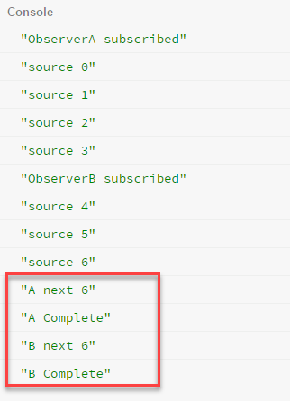

# Subject

subject 是一個很特別的東西，他同時間是 observable 也是 observer。可以管理多個 observable ，也可以同時發送資料到多個 observe 。主要的用途是 `multicast`

## subject種類

Subject 有 `Subject`、`BehaviorSubject`、`ReplaySubject` 和 `AsyncSubject` ，每一個 subject 都有各自的特性，以下一一介紹

## Multicasted Observables 

這小節會用 subject 來解釋什麼是 multicast

我們都知道RxJS的Observeable會在subscribe的時候才會執行，所以每一次的subscribe都會執行一次，但是，某些情況下我們並不想要那樣子做，而 MultiCasting的觀念是避免處理一個Observeable多個Observer的情況時而不重複執行Observable。

**假設情境**

```typescript
var source = Observable.interval(1000).take(5)
var ObserverA = {
  next: function(value){ console.log('A next '+ value);	},
  error: function(error){ console.error('A error '+ error);   },
  complete: function(){ console.log('A Complete');}
}
source.subscribe(ObserverA);
var ObserverB = {
  next: function(value){ console.log('B next '+ value);	},
  error: function(error){ console.error('B error '+ error);   },
  complete: function(){ console.log('B Complete');}
}
setTimeout(function(){
  	source.subscribe(ObserverB);
},2000);
```

執行結果


為了要讓兩個 Observer 共用同樣的資料流，這時候就需要透過 subject 的幫助，讓 subject 當中間人，幫忙我們去監聽 observable  回傳的結果，而 observer 就訂閱 subject 時，就可以取得 observable 的資料了

```typescript
var source = Observable.interval(1000).take(5)
var subject = Subject.create();
var ObserverA = {
  next: function(value){ console.log('A next '+ value);	},
  error: function(error){ console.error('A error '+ error);   },
  complete: function(){ console.log('A Complete');}
}
subject.subscribe(ObserverA);
source.subscribe(subject);
var ObserverB = {
  next: function(value){ console.log('B next '+ value);	},
  error: function(error){ console.error('B error '+ error);   },
  complete: function(){ console.log('B Complete');}
}
setTimeout(function(){
  	subject.subscribe(ObserverB);
},2000);
```

接下來延伸出來的問題是，這樣子的寫法很複雜，所以 RxJS 提供了 operator 來簡化寫法，我們可以使用 `multicast`，將 Subject.create() 給包起來。

```typescript
var source = Observable.interval(1000).take(5)
               .multicast(new Subject())
var ObserverA = {
  next: function(value){ console.log('A next '+ value);	},
  error: function(error){ console.error('A error '+ error);   },
  complete: function(){ console.log('A Complete');}
}
source.connect();
source.subscribe(ObserverA);
var ObserverB = {
  next: function(value){ console.log('B next '+ value);	},
  error: function(error){ console.error('B error '+ error);   },
  complete: function(){ console.log('B Complete');}
}
setTimeout(function(){
  	source.subscribe(ObserverB);
},2000);
```

* 使用 multicast 就必須搭配 connect() 來執行 observeable。

RxJS 又很好心的提供 operator 來簡化 `.multicast(Rx.Subject.create())` 的寫法

| mutlicast                        | publish operator   |
| -------------------------------- | ------------------ |
| multicast(new Subject())         | publsih()          |
| multicast(new BehaviorSubject()) | publishBehavior(n) |
| multicast(new ReplaySubject())   | publishReplay(n)   |
| multicast(new AsyncSubject())    | publishLast()      |

回到 multicast 需搭配 connect() 的問題，這樣的方式，可以說是全手動，那是否有全自動的寫法，意思是當有人訂閱 subject 時，subject 自動啟動呢? 答案是有的，透過 `refCount()` 的幫忙，就可以達到上述的效果

refCount 的起動/關閉條件是，訂閱數是否大於 0 ，如果訂閱者大於 0 時，則啟動 observable，反之則停止 observable。

```typescript
var source = Observable.interval(1000)
               .do(x => console.log('souce '+ x))
               .publish()
               .refCount()
var ObserverA = {
  next: function(value){ console.log('A next '+ value);	},
  error: function(error){ console.error('A error '+ error);   },
  complete: function(){ console.log('A Complete');}
}
var subA = source.subscribe(ObserverA);
var ObserverB = {
  next: function(value){ console.log('B next '+ value);	},
  error: function(error){ console.error('B error '+ error);   },
  complete: function(){ console.log('B Complete');}
}
var subB
setTimeout(function(){
  	subB = source.subscribe(ObserverB);
},2000);
setTimeout(function(){
  subA.unsubscribe();
  console.log('unsubscribe A');
},5000)
setTimeout(function(){
  subB.unsubscribe();
  console.log('unsubscribe B');
},7000)
```

執行結果


在更近一步的簡化，就是 `share()` ，`share`是 publish() + refCount() 的縮寫。

```typescript
var source = Observable.interval(1000)
               .do(x => console.log('souce '+ x))
               .share()
var ObserverA = {
  next: function(value){ console.log('A next '+ value);	},
  error: function(error){ console.error('A error '+ error);   },
  complete: function(){ console.log('A Complete');}
}
var subA = source.subscribe(ObserverA);
var ObserverB = {
  next: function(value){ console.log('B next '+ value);	},
  error: function(error){ console.error('B error '+ error);   },
  complete: function(){ console.log('B Complete');}
}
var subB
setTimeout(function(){
  	subB = source.subscribe(ObserverB);
},2000);
setTimeout(function(){
  subA.unsubscribe();
  console.log('unsubscribe A');
},5000)
setTimeout(function(){
  subB.unsubscribe();
  console.log('unsubscribe B');
},7000)
```

執行結果是一樣的


## BehaviorSubject

BehaviorSubject會記錄**最後一次的值**，當後來註冊進來的subscriber可以知道當下的值是什麼

所以BehaviorSubject在建立時，需要指定一個初始值，程式碼如下

```typescript
var source = Observable.interval(1000).take(5)
               .do(function(value){ console.log('source ' + value);})
var subject = new BehaviorSubject(0); // 0 is the initial value
var ObserverA = {
  next: function(value){ console.log('A next '+ value);	},
  error: function(error){ console.error('A error '+ error);   },
  complete: function(){ console.log('A Complete');}
}
var ObserverB = {
  next: function(value){ console.log('B next '+ value);	},
  error: function(error){ console.error('B error '+ error);   },
  complete: function(){ console.log('B Complete');}
}
source.subscribe(subject);
subject.subscribe(ObserverA);
 console.log('ObserverA subscribed');
setTimeout(function(){
  subject.subscribe(ObserverB);
  console.log('ObserverB subscribed');
},2000)
```

**執行結果**


## ReplaySubject

ReplaySubject有點類似於BehaviorSubject，可以取得subscribe之前的值，只是可以取不只一個。類似回播的功能

ReplaySubject在建立時有幾個參數可以設定

```typescript
var subject = new ReplaySubject(bufferSize, windowTime);
```

* bufferSize: ReplaySubject可以儲存 x 數量的值
* windowTime: ReplaySubject取最後 x milliseconds 期間的值

**程式碼 (with no windowTime參數)**

```typescript
var source = Observable.interval(500).take(7)
               .do(function(value){ console.log('source ' + value);})
var subject = new ReplaySubject(3); // 0 is the initial value
var ObserverA = {
  next: function(value){ console.log('A next '+ value);	},
  error: function(error){ console.error('A error '+ error);   },
  complete: function(){ console.log('A Complete');}
}
var ObserverB = {
  next: function(value){ console.log('B next '+ value);	},
  error: function(error){ console.error('B error '+ error);   },
  complete: function(){ console.log('B Complete');}
}
source.subscribe(subject);
subject.subscribe(ObserverA);
 console.log('ObserverA subscribed');
setTimeout(function(){
  subject.subscribe(ObserverB);
  console.log('ObserverB subscribed');
},2000)
```

執行結果


**程式碼 (with windowTime參數)**

```typescript
var source = Observable.interval(500).take(7)
               .do(function(value){ console.log('source ' + value);})
// source: 0--1--2--3--4--5--6-----
//      A: 0--1--2--3--4--5--6-----
//              |---|: windowTime 
//      B:         23--4--5--6-----
var subject = new ReplaySubject(3, 700); // 0 is the initial value
var ObserverA = {
  next: function(value){ console.log('A next '+ value);	},
  error: function(error){ console.error('A error '+ error);   },
  complete: function(){ console.log('A Complete');}
}
var ObserverB = {
  next: function(value){ console.log('B next '+ value);	},
  error: function(error){ console.error('B error '+ error);   },
  complete: function(){ console.log('B Complete');}
}
source.subscribe(subject);
subject.subscribe(ObserverA);
 console.log('ObserverA subscribed');
setTimeout(function(){
  subject.subscribe(ObserverB);
  console.log('ObserverB subscribed');
},2000)
```

執行結果


## AsyncSubject

AsyncSubject只會記錄 Observable **完成後**的值。

```typescript
var source = Observable.interval(500).take(7)
               .do(function(value){ console.log('source ' + value);})
var subject = new AsyncSubject(); // 0 is the initial value
var ObserverA = {
  next: function(value){ console.log('A next '+ value);	},
  error: function(error){ console.error('A error '+ error);   },
  complete: function(){ console.log('A Complete');}
}
var ObserverB = {
  next: function(value){ console.log('B next '+ value);	},
  error: function(error){ console.error('B error '+ error);   },
  complete: function(){ console.log('B Complete');}
}
source.subscribe(subject);
subject.subscribe(ObserverA);
 console.log('ObserverA subscribed');
setTimeout(function(){
  subject.subscribe(ObserverB);
  console.log('ObserverB subscribed');
},2000)
```

執行結果



## Multicasting Operators

### multicast

要達到 multicast 的效果，所以會回傳一個 subject (任何類型的 subject)


**使用介面**

```typescript
multicast(subjectOrSubjectFactory: Function | Subject, selector: Function): Observable
```

**使用範例**

```typescript
let multicasted = source.multicast(()=> new Subject());
multicasted.connect(); // 開始運作
```

### publish

publish 是 multicast 輸出 subject 的縮寫


**使用介面**

```typescript
 publish(selector: Function): *
```

**使用範例**

```typescript
let multicasted = source.publish();
multicasted.connect(); // 開始運作
```

### publishBehavior

publish 是 multicast 輸出 BehaviorSubject 的縮寫

### publishLast

publish 是 multicast 輸出 AsyncSubject 的縮寫

### publishReplay

publish 是 multicast 輸出 ReplaySubject 的縮寫

### share

share 是 publish 加上 refCount 的縮寫


**使用介面**

```typescript
share(): Observable<T>
```

**使用範例**

```typescript
let source = Observable.ajax(url).share();
```

### shareReplay

share 是 publishReplay 加上 refCount 的縮寫

**使用介面**

```typescript
shareReplay<T>(this: Observable<T>, bufferSize?: number, windowTime?: number, scheduler?: IScheduler): Observable<T>;
```

**使用範例**

```typescript
let source = Observable.ajax(url).shareReplay(3,2);
```


