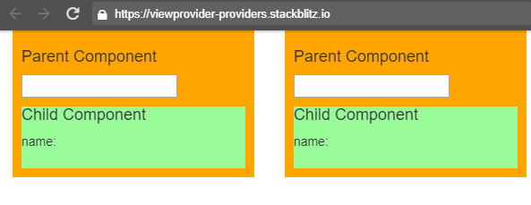

# 進階議題

## viewProviders V.S. providers

我們知道 Angular 的 `Injection System` ，讓 component / service / directive 等可以在 `constructor` 的地方注入想要使用的服務，根據服務註冊的地方，Angular 會提供一樣或是不一樣的服務實體，到這個地方，是我們所熟知的運作方式

當然我們也可以在 component 註冊服務，已提供本身跟與本身有關的子物件使用，在閱讀 API 文件時，發現 component 有兩個註冊服務的方法，`providers` 與 `viewProviders` 這兩者在說明分別為

- `providers`  list of providers available to this component and its children
- `viewProviders` list of providers available to this component and its view children

看起來很像，但到底差異在哪裡呢? 主要差異是在於子 component 的呈現方式會因不同註冊服務的方式而有所不同

# 基本環境設定

來解釋一下，但先準備一下程式環境

```typescript
// AppComponent 的樣版
<div class="col-md-3">
	<app-parent></app-parent>
</div>
<div class="col-md-3">
	<app-parent></app-parent>
</div>

// ParentComponet
import { Component, OnInit } from '@angular/core';
import { SimpleService } from '../simple.service';
@Component({
  selector: 'app-parent',
  template: `
    <h4>Parent Component</h4>
    <input type="text" [(ngModel)]="simpleService.name" />
  `,
  styleUrls: ['./parent.component.css']
})
export class ParentComponent {
  constructor(public simpleService: SimpleService) { }
}

// ChildComponent
import { Component, OnInit } from '@angular/core';
import { SimpleService } from '../simple.service';
@Component({
  selector: 'app-child',
  template: `
    Child Component <br/>
    value: {{ simpleService.name }}
  `,
  styleUrls: ['./child.component.css']
})
export class ChildComponent {
  constructor(public simpleService: SimpleService) { }
}

// SimpleService
import { Injectable } from '@angular/core';

@Injectable()
export class SimpleService {
  name: string;
}
```

# NgModule.providers

```typescript
@NgModule({
  ...
  providers: [SimpleService]
})
export class AppModule { }

```


在初始狀態， `SimpleService` 是註冊在 `app.module.ts` 內，畫面是這樣



不論在左邊或是右邊的 Parent Component 輸入資料時，Child Component 都會顯示所輸入的資料


這時 service 取得的順序


很清楚的，不論是 `ParentComponent` 或是 `ChildComponent` 都是存取註冊在 `NgModle` 的 `SimpleService`

(圖片擷取至[codecraft.tv](https://codecraft.tv))

# Component.providers

這時當 `ParentComponent` 註冊 `SimpleService` 到 `providers` 內時，會有怎樣的效果呢

```typescript
import { Component, OnInit } from '@angular/core';
import { SimpleService } from '../simple.service';
@Component({
  selector: 'app-parent',
  template: `
    <h4>Parent Component</h4>
    <input type="text" [(ngModel)]="simpleService.name" />
    <br/>
    <app-child></app-child>
	<!--或是這種方式-->
    <!--<ng-content></ng-content>-->
  `,
  providers: [SimpleService],  
  styleUrls: ['./parent.component.css']
})
export class ParentComponent {

  constructor(public simpleService: SimpleService) { }
}
```

執行結果


 service 取得的順序


(圖片擷取至[codecraft.tv](https://codecraft.tv))

在這個情境，不論 `ChildComponent` 是已哪一種方式顯示在 `ParentComponent` 都會存取到註冊在 `ParentComponent` 的 providers，而因為 `AppComponent` 有兩個 `ParentComponent` ，所以各自有各自的 `SimpleService` 互不干擾

# Component.viewProviders

如果將 `SimpleService` 註冊到 `viewProviders` 時，並子 component 是透過 `<ng-content>` 映射到 `ParentComponent` 時

```typescript
import { Component, OnInit } from '@angular/core';
import { SimpleService } from '../simple.service';
@Component({
  selector: 'app-parent',
  template: `
    <h4>Parent Component</h4>
    <input type="text" [(ngModel)]="simpleService.name" />
    <br/>
    <ng-content></ng-content>
  `,  
  viewProviders: [SimpleService],
  styleUrls: ['./parent.component.css']
})
export class ParentComponent {

  constructor(public simpleService: SimpleService) { }
}
```

```html
// app-component.html
<app-parent>
  <app-child></app-child>
</app-parent>
```

執行結果


 service 取得的順序


(圖片擷取至[codecraft.tv](https://codecraft.tv))

`viewProviders` 比較特殊一點，透過 `<ng-content>` 呈現與不透過 `<ng-content>` 的結果不一樣，假設使用 `<ng-content>` 的方式將 `ChildComponent` 映射到 `ParentComponent` 時，兩者所讀取的 `SimpleService` 會是不同一個 (可參閱上圖)；但如果是直接在 `ParentComponent` 上使用 `ChildComponent` 時，所存取的 `SimpleService` 就會跟 `ParentComponent` 一樣，這部分就要留意了

