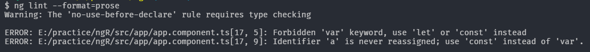
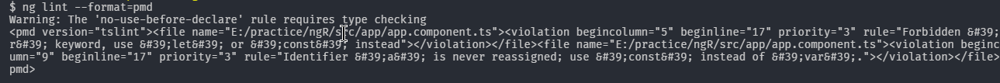
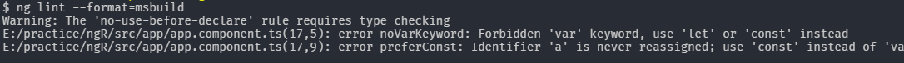
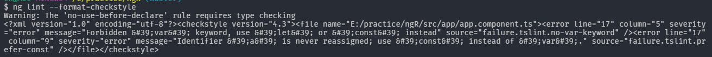

# Angular CLI

Angular CLI 是 Angular Team 與社群一起合作創造出來的工具，Angular CLI (以下簡稱為 CLI) 提供一系列的指令，讓開發者可以從建置專案、開發、測試、一直到部屬，都可以透過 CLI 的幫助下完成。


# 安裝篇

我們可以透過 `npm` 安裝 CLI，打開命令視窗輸入以下的指令 (windows/mac 皆適用)

> npm install -g @angular/cli


當安裝完成後，可以透過 `ng -v` 的指令來檢查安裝的版本


當看到這個畫面時，就表示 Angular CLI 安裝成功了


# 指令篇

Angular CLI 的命令都需要透過 `ng` 使用

> ng <command>


## new

`ng new [專案名稱]` 建立新的 Angular 專案，預設會建立一個與專案名稱相同的資料夾，並在該資料夾內初始化 Angular 專案

### 參數

* **directory**

  * `--directory` (alias: `-dir`)  預設值 ： `[專案名稱]` 
  * 設定建立專案的隸屬資料夾名稱

* **dry-run**

  * `--dry-run` (alias: `-d`)  預設值：`false`
  * 顯示建立專案時會產生的檔案清單，但不會實際產生實體檔案

* **inline-style**

  * `--inline-style` (alias: `-is`)  預設值：`false`
  * 使用 `inline-style` 模式

* **inline-template**

  * `--inline-template` (alias: `-it`)  預設值：`false`
  * 使用 `inline-template` 模式

* **minimal**

  * `--minimal` 預設值：`false`

  * 產生最小單位的 Angular 專案

  * 最小單位的 Angular 專案結構

    

  * 完整的 Angular 專案架構

    

* **prefix**

  * `--prefix` (alias: `-p`)  預設值: app
  * 給 `component selector` 使用的前綴詞
  * 可事後由 `.angular-cli.json` 設定

* **routing**

  * `--routing`  預設值：`false`
  * 建立路由模組

* **skip-commit**

  * `--skip-commit` (alias: `-sc`)  預設值：`false`
  * 忽略第一次建立時的 git 簽入動作

* **skip-git**

  * `--skip-git` (alias: `-sg`) 預設值：`false`
  * 不建立 git Repository

* **skip-install**

  * `--skip-install` (alias: `-si`) *預設值：`false`*
  * 建立新專案時，不執行安裝套件動作 (install packages)

* **skip-test**

  * `--skip-tests (aliases: `-st) 預設值：`false`
  * 不建立 `spec` 測試檔案
  * 不包含 `e2e` 測試功能

* **source-dir**

  * `--source-dir` (alias: `-sd`) 預設值： src
  * 主專案程式存放的資料夾名稱
  * 可事後由 `.angular-cli.json` 設定 (app[0].root)

* **style**

  * `--style` 預設值：css
  * 支援以下格式
    * css
    * scss
    * less
    * sass
    * styl (stylus)
  * 可事後由 `.angular-cli.json` 設定 (defaults.styleExt)

* **verbose**

  * `--verbose` (alias: `-v`) 預設值：`false`
  * 顯示更多輸出資訊


## serve

`ng serve` 指令會進行專案建置並啟動網頁伺服器

可以搭配使用的參數說明如下

### 參數

* **host**
  * `--host` (aliases: `-H`) 預設值: localhost
  * 預設指監聽 localhost
* **hmr**
  * `—hmr` 預設值: false
  * 啟動模組熱拔插功能
* **live-reload**
  * `--live-reload` (aliases: `-lr`) 預設值: true
  * 使用 `live-reload` 監控異動，當有異動時則會重整畫面。
* **public-host**
  * `--public-host` (aliases: `--live-reload-client`)
  * 指定一個其他使用者可以瀏覽的網址。
* **disable-host-check**
  * `--disable-host-check`  預設值: false
  * 不檢查連線使用者連線是否來自允許的網域。
* **open**
  * `--open` (aliases: `-o`) 預設值: false
  * 在預設瀏覽器打開網址
* **port**
  * `--port` (aliases: `-p`) 預設值: 4200
  * 網站伺服器所使用的連接阜
* **ssl**
  * `--ssl`
  * 網站伺服器使用 `HTTPS`
* **ssl-cert**
  * `--ssl-cert` (aliases: `-`) 
  * 指定 SSL 憑證位置給網站伺服器使用
* **ssl-key**
  * `--ssl-key`
  * 指定 SSL 金鑰位置給網站伺服器使用
* **aot**
  * `--aot`
  * 使用 `AOT` 模式建置專案
* **base-href**
  * `--base-href` (aliases: `-bh`)
  * 設定 `<base>` 網址
* **deploy_url**
  * `--deploy-url` (aliases: `-d`)
  * 設定部署網址
* **environment**
  * `--environment` (aliases: `-e`)
  * 指定環境變數檔
* **extract-css**
  * `--extract-css` (aliases: `-ec`)
  * 是否將 `global style`內設定的 css 檔案建置為 css 檔案而非 js 檔案
* **i18n-file**
  * `--i18n-file`
  * 指定多國語系檔位置
* **i18n-format**
  * `--i18n-format`
  * 設定多國語系檔格式
* **locale**
  * `--locale`
  * 設定語系
* **output-hashing**
  * `--output-hashing` (aliases: `-oh`)
  * 設定輸出檔案檔名模式(cache-busting hashing mode)，可使用的參數如下
    * none
    * all
    * media
    * bundles
* **output-path**
  * `--output-path` (aliases: `-op`) 
  * 設定建置輸出位置
* **poll**
  * `--poll`
  * 設定檢查檔案異動頻率 (微秒)
  * 屬 webpack watchOptions 參數 (https://webpack.js.org/configuration/watch/#watchoptions)
* **progress**
  * `--progress` (aliases: `-pr`) 預設值: true
  * 顯示建置進度
* **sourcemap**
  * `--sourcemap` (aliases: `-sm`, `sourcemaps`)
  * 輸出 souremap
* **target**
  * `--target` (aliases: `-t`, `-dev`, `-prod`) 預設值: development
  * 設定建置模式 (development模式，production模式)
* **vendor-chunk**
  * `--vendor-chunk` (aliases: `-vc`) 預設值: true
  * 是否將 `vendor` 單獨建置成獨立的檔案
* **common-chunk**
  * `--common-chunk` (aliases: `-cc`) 預設值: true
  * 是否將重複性質的程式碼單獨建置成獨立的檔案
* **verbose**
  * `--verbose` (aliases: `-v`) 預設值: false
  * 是否要顯示更多的資訊
* **watch**
  * `--watch` (aliases: `-w`)
  * 當檔案異動時，重新建置專案

### 備註

當執行 `ng serve` 時，所有的過程都是在記憶體裡完成的，所以不會有實體檔案的輸出。


## generate

`ng generate [name]` 建立指定的藍圖範本

### 預設範本

* class
* component
* directive
* enum
* guard
* interface
* module
* pipe
* service

### 參數

* **dry-run**
  * `--dry-run` (aliases: `-d`) 預設值: false
  * 顯示會產生與異動的檔案內容，但不會真正的執行
* **lint-fix**
  * `--lint-fix` (aliases: `-lf`)
  * 在建立範本後使用 `lint` 修正樣式
  * 可於 `.angular-cli.json` 內設定為預設選項 (`defaults.lintFix`)。
* **verbose**
  * `--verbose` (aliases: `-v`) 預設值: false
  * 顯示更多輸出資訊
* **collection**
  * `--collection` (aliases: `-c`) 預設值 : @schematics/angular
  * 設定要使用的 `Schematics` 集合


## build

`ng build` 建置專案並輸出到資料夾

### 建置專案

> ng build

預設專案輸出的資料夾是 `dist/`。

所有建置或是服務命令 (`ng build/serve/e2e/`)，預設都會移除 `dist/` 資料夾，這行為可以透過 `--no-delete-output-path` 或 `--delete-output-path=false` 的參數停用

### 建置類型與環境變數檔案 (Build Targets and Environment Files)

`ng build` 可以預設可以指定兩種建置目標 ( `--target=production` 或 `--target=development`)，並且使用相對應的環境變數檔案 (`--environment=prod` 或 `--environment=dev`)。預設目標是 `development`

環境變數與建置目標的對應檔，可以在  `.angular-cli.json` 內找到

```json
"environmentSource": "environments/environment.ts",
"environments": {
  "dev": "environments/environment.ts",
  "prod": "environments/environment.prod.ts"
}
```

以下的使用的參數也適用於 `ng serve`，如果沒有特定指定，預設對應是 `dev` 對 `development`，`prod` 對 `production`。

```
# these are equivalent
ng build --target=production --environment=prod
ng build --prod --env=prod
ng build --prod
# and so are these
ng build --target=development --environment=dev
ng build --dev --e=dev
ng build --dev
ng build
```

當然，也可以自行新增環境變數及目標

* 建立 `src/environments/environment.NAME.ts` 檔案
* 於 `.angular-cli.json` 新增`{ "NAME": 'src/environments/environment.NAME.ts' }` 至 `apps[0].environments` 區塊內 。
* 在 `build/serve` 時可以過 `--env=Name` 參數設定來使用新增的環境變數

### Base Tag

`build` 提供方法 (`--base-href your-url`)可以從外部修改 `index.html` 的 `<base href="/">` 標籤

```
# Sets base tag href to /myUrl/ in your index.html
ng build --base-href /myUrl/
ng build --bh /myUrl/
```

### 合併及瘦身 (Tree-Shaking)

當要部署專案到正式環境時，一定要使用 `production` 模式，`production` 模式會讓專案的檔案大小縮到最小，而且執行速度也會因為 `AOT` 的關係而大幅提升。以下是 `development` 與 `production` 的開啟功能比較

| 參數               | --dev | --prod |
| :--------------- | :---: | :----: |
| --aot            | false |  true  |
| --environment    |  dev  |  prod  |
| --output-hashing | media |  all   |
| --sourcemaps     | true  | false  |
| --extract-css    | false |  true  |
| --named-chunks   | true  | false  |

`--prod`還會另外執行以下幾件事情

1. 如果 `.angular-cli.json` 有設定使用 `service-worker`時，CLI 會加入 `service-worker`
2. 替換 `process.env.NODE_ENV` 的設定為 `production`
3. 執行 `UglifyJS`

### Service Worker

目前尚屬**實驗性質**的功能，只能在 `production` 建置模式下使用。如要啟動，需要執行以下指令

```
npm install @angular/service-worker --save
ng set apps.0.serviceWorker=true
```

於 `--prod` 建置目標下，檔案會自動建立並載入。

### 參數

* **aot**
  * `--aot` 預設值: false
  * 建置時使用 `Ahead of Time` 編譯模式
* **app**
  * `--app` (aliases: `-a`)
  * 使用名稱 (name) 或位置 (index) 來指定要建置的專案設定
* **base-href**
  * `--base-href` (aliases: `-bh`)
  * 設定 `<base>` 網址
* **deploy_url**
  * `--deploy-url` (aliases: `-d`)
  * 設定部署網址
* **environment**
  - `--environment` (aliases: `-e`)
  - 指定環境變數檔
* **extract-css**
  - `--extract-css` (aliases: `-ec`)
  - 是否將 `global style`內設定的 css 檔案建置為 css 檔案而非 js 檔案
* **i18n-file**
  - `--i18n-file`
  - 指定多國語系檔位置
* **i18n-format**
  - `--i18n-format`
  - 設定多國語系檔格式
* **locale**
  - `--locale`
  - 設定語系
* **output-hashing**
  - `--output-hashing` (aliases: `-oh`)
  - 設定輸出檔案檔名模式(cache-busting hashing mode)，可使用的參數如下
    - none
    - all
    - media
    - bundles
* **output-path**
  - `--output-path` (aliases: `-op`) 
  - 設定建置輸出位置
* **poll**
  - `--poll`
  - 設定檢查檔案異動頻率 (微秒)
  - 屬 webpack watchOptions 參數 (https://webpack.js.org/configuration/watch/#watchoptions)
* **progress**
  - `--progress` (aliases: `-pr`) 預設值: true
  - 顯示建置進度
* **sourcemap**
  - `--sourcemap` (aliases: `-sm`, `sourcemaps`)
  - 輸出 souremap
* **stats-json**
  * `--stats-json`
  * 產生 `stats.json` 檔案，可以利用 `wepack-bundle-analyzer` 或  *https://webpack.github.io/analyse* 做分析
* **target**
  - `--target` (aliases: `-t`, `-dev`, `-prod`) 預設值: development
  - 設定建置模式 (development模式，production模式)
* **vendor-chunk**
  - `--vendor-chunk` (aliases: `-vc`) 預設值: true
  - 是否將 `vendor` 單獨建置成獨立的檔案
* **common-chunk**
  - `--common-chunk` (aliases: `-cc`) 預設值: true
  - 是否將重複性質的程式碼單獨建置成獨立的檔案
* **verbose**
  - `--verbose` (aliases: `-v`) 預設值: false
  - 是否要顯示更多的資訊
* **watch**
  - `--watch` (aliases: `-w`)
  - 當檔案異動時，重新建置專案
* **show-circular-dependencies**
  * *--show-circular-dependencies (aliases: -scd)*
  * 顯示循環參考的警示
* **build-optimizer**
  * `--build-optimizer`
  * (實驗性質) 啟動 `@angular-devkit/build-optimizer` 建置模式
  * 須配合 `--aot` 使用
* **named-chunks**
  * `--named-chunks` (aliases: -nm)
  * 延遲載入的檔案名稱使用名稱而非數字


## lint

`ng lint` 會使用 `tsling` 的規則檢查專案程式的格式

### 參數

* **fix**

  * `--fix` 預設值: false
  * 修正格式錯誤

* **force**

  * `--force` 預設值: false
  * 即使有格式錯誤，仍顯示成功

* **type-check**

  * `--type-check` 預設值: false
  * 控制型別檢查

* **format**

  * `--format` (aliases: `-t`) 預設值:  prose

  * 輸出格式

    * prose

      

    * json

      

    * stylish

      

    * verbose

      

    * pmd

      

    * msbuild

      

    * checkstyle

      

    * vso

      

    * fileslist

      


## e2e

`ng e2e` 執行並使用 `Protractor` 進行 end-to-end 測試。

### 參數

* **config**

  * `--config` (aliases: `-c`)
  * 指定設定檔，預設會使用在 `.angular-cli.json` 內設定的 protractor 設定檔位置

* **element-explorer**

  * `--element-explorer` (aliases: `-ee`) 預設值: false
  * 啟動 Protractor's Element Explorer

* **serve**

  * `--serve` (aliases: `-s`) 預設值: true
  * 啟動建置與啟動網站伺服器功能，所有 `serve` 的參數都可以使用

* **specs**

  * `--specs` (aliases: `-sp`) 預設值: []

  * 複寫 protractor 設定檔內的 specs 檔案位置

  * 指定要測試的檔案

  * 如果要指定多個測試檔案，可以這樣子表示

    ```
    ng e2e --specs=spec1.ts --specs=spec2.ts
    ```

* **webdrive-update**

  * `--webdrive-update` (aliases: `-wu`) 預設值: true
  * 嘗試更新 `webdriver`


## xi18n


## doc


# 設定篇


# 應用篇

