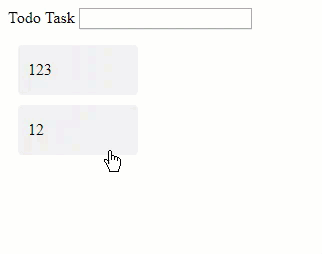

# Animations

適當的使用動畫效果可以提升使用者體驗，利用轉場效果來掩飾一些需要等待的動作，Angular Animations 在 4 版大改版之後，變得容易上手，好用，這章節會來介紹 Angular Animations

Angular animations 是建構在 Web Animations API 上，當一些早期瀏覽器會遇到不支援的情形，這時候可將 `polyfills` 內的 `web-animation-js` 打開就可以了

# 設定

Animation 的 package 名稱是 `@angular/animations`，但是要 import 的 module 卻是在 `@angular/platform-browser/animations` 

```typescript
import { BrowserAnimationsModule } from '@angular/platform-browser/animations';
...
@NgModule({
  ...
  imports: [
    BrowserModule,
    BrowserAnimationsModule
  ],
  ...
})
export class AppModule { }
```

當我們在根模組內 import 完動畫模組後，即完成最基本的設定了。在 `@angular/platform-browser/animations` 內還有另外一個跟 Animations 有關的模組叫做 `NoopAnimationsModule`，這個模組的用意是當我們不想要啟用動畫，但是又不想去改已經使用動畫的 Components 時，這時候就可以 import `NoopAnimationsModule` 來達到無動畫的設定

# 範例

> 建立一個清單，新增或是移除項目時，使用動畫效果

## TodoService

```typescript
import { Injectable } from '@angular/core';

export class Todo {
  constructor(public task: string, public state = 'incompleted') {}

  toggleState() {
    this.state = this.state === 'incompleted' ? 'completed' : 'incompleted';
  }
}

@Injectable()
export class TodoService {
  todos: Todo[] = [];

  addTodo(task) {
    this.todos.push(new Todo(task));
  }

  canRemove() {
    return this.todos.length > 0;
  }

  removeTodo() {
    this.todos.length -= 1;
  }
}

```

## app.component.ts

```typescript
import { Component } from '@angular/core';
import { trigger, state, style, animate, transition } from '@angular/animations';
import { TodoService } from './todo.service';

@Component({
  selector: 'app-root',
  template: `
  <label>Todo Task</label>
  <input type="text" #task (keyup.enter)="addTodo(task.value); task.value=''"/>
  <ul>
    <li *ngFor="let todo of todos"
        [@todoState]="todo.state"
        (click)="todo.toggleState()">
      {{todo.task}}
    </li>
  </ul>
  `,
  styleUrls: ['./app.component.css'],
  animations: [
    trigger('todoState', [
      state(
        'incompleted',
        style({
          backgroundColor: '#eee',
          transform: 'scale(1)'
        })
      ),
      state(
        'completed',
        style({
          backgroundColor: '#cfd8dc',
          transform: 'scale(1.1)'
        })
      ),
      transition('incompleted => completed', animate('100ms ease-in')),
      transition('completed => incompleted', animate('100ms ease-out'))
    ])
  ]
})
export class AppComponent {
  todos = this.todoService.todos;

  addTodo(task) {
    this.todoService.addTodo(task);
  }
  constructor(private todoService: TodoService) {}
}

```

### 細部說明

```html
 <li *ngFor="let todo of todos"
     [@todoState]="todo.state"
     (click)="todo.toggleState()">
   {{todo.task}}
</li>
```

- `[@todoState]` 連結 `animations` 的 `trigger` 項目

```typescript
animations: [
    trigger('todoState', [
      state(
        'incompleted',
        style({
          backgroundColor: '#eee',
          transform: 'scale(1)'
        })
      ),
      state(
        'completed',
        style({
          backgroundColor: '#cfd8dc',
          transform: 'scale(1.1)'
        })
      ),
      transition('incompleted => completed', animate('100ms ease-in')),
      transition('completed => incompleted', animate('100ms ease-out'))
    ])
  ]
```

- 動畫會設定在 `animations:[]` 的區塊內

- 使用 `trigger` 設定動畫

  - animations 重要元素之一 `state` ，動畫的效果是透過轉換 state 來完成相關的轉場效果

  - `state` 設定初始狀態

  - `transition` 過場效果

    

    - 如果多個 state 有相同的過場效果，可以寫在一起

      ```typescript
      transition('inactive => active, active => inactive',
       animate('100ms ease-out'))
      ```

    - 如果是兩個 state 間切換時，可以透過雙箭頭來表示

      ```typescript
      transition('inactive <=> active', animate('100ms ease-out'))
      ```

- 效果

  

### 延伸說明

#### `transaction`

除了上述的 state 間的設定，也可以針對轉場效果做進一步的設定，這邊的設定只會存活在過場動畫時，當轉換結束時，樣式也會失效了。所以要固定最後的顯示效果，就必須定義在 `state` 下

```typescript
transition('incompleted => completed', [
        style({
          backgroundColor: '#cfd8dc',
          transform: 'scale(1.3)'
        }),
        animate(
          '80ms ease-in',
          style({
            backgroundColor: '#eee',
            transform: 'scale(1)'
          })
        )
      ])
```


#### `wildcard state *`

the `*` (wildcard) 可代表任何 state，使用範例

1. `completed => *` 代表從 `completed` 到任何階段都會觸發轉場動畫
2. `* => *` 表示任何異動都會觸發轉場動畫


#### `void state`

`void` state 會發生在元素尚未附加到顯示畫面上，或是從顯示畫面移除，通常會使用在元素進入和離開的情境


# 延伸變化

## 示範進入離開的效果

```typescript
transition('void => *', [style({ transform: 'translateX(-100%)' }), animate(100)]),
transition('* => void', [animate(100, style({ transform: 'translateX(100%)' }))])
```

新增這兩個新增 `transition` 效果，當新增項目時，元素會從左邊飛進來，當移除時，會往右邊飛走


另外一種表示法式使用 `:enter` 和 `:leave` 來替代 `void=>*` 與 `*=>void`，效果是一樣的

```typescript
transition(':enter', [style({ transform: 'translateX(-100%)' }), animate(100)]),
transition(':leave', [animate(100, style({ transform: 'translateX(100%)' }))])
```

##  多狀態進入離開

- Incompleted todo 進入: `void => incompleted`
- Completed todo 進入: `void => completed`
- Incompleted todo 離開: `incompleted => void`
- Completed todo 離開: `completed=> void`

```typescript
 transition('void => incompleted', [
   style({transform: 'translateX(-100%) scale(1)'}),
   animate(100)
 ]),
   transition('incompleted => void', [
   animate(100, style({transform: 'translateX(100%) scale(1)'}))
 ]),
   transition('void => completed', [
   style({transform: 'translateX(0) scale(0)'}),
   animate(200)
 ]),
   transition('completed => void', [
   animate(200, style({transform: 'translateX(0) scale(0)'}))
 ])
```


