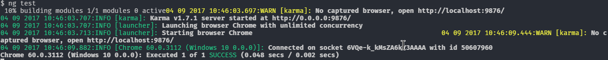
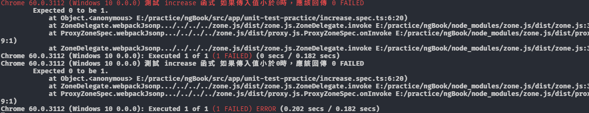
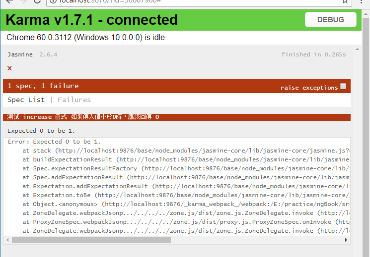
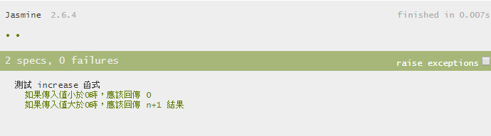

# 單元測試

一般來說，單純測試邏輯的測試是最簡單的，因為不需要去理會頁面上的變化，只針對單一的函式分別測試，但在往下探討前，我們先把一個用來學習測試的環境建構出來，透過 Angular CLI 的幫忙，可以快速地完成這個任務，請跟著下列的動作完成

1. 執行 `ng new <projectName>`
2. 等待 npm install
3. 當 npm install 完成後，進入專案資料夾
4. 執行 `ng test`
5. 打完收工

CLI 預設會先幫我們建立一個 `app.component.spec.ts` 的測試檔案，先將該檔案打開，會是一個最簡單的測試，這測試屬於整合測試，會在下一章節討論

```typescript
import { TestBed, async } from '@angular/core/testing';

import { AppComponent } from './app.component';

describe('AppComponent', () => {
  beforeEach(async(() => {
    TestBed.configureTestingModule({
      declarations: [
        AppComponent
      ],
    }).compileComponents();
  }));

  it('should create the app', async(() => {
    const fixture = TestBed.createComponent(AppComponent);
    const app = fixture.debugElement.componentInstance;
    expect(app).toBeTruthy();
  }));

  it(`should have as title 'app'`, async(() => {
    const fixture = TestBed.createComponent(AppComponent);
    const app = fixture.debugElement.componentInstance;
    expect(app.title).toEqual('app');
  }));

  it('should render title in a h1 tag', async(() => {
    const fixture = TestBed.createComponent(AppComponent);
    fixture.detectChanges();
    const compiled = fixture.debugElement.nativeElement;
    expect(compiled.querySelector('h1').textContent).toContain('Welcome to app!');
  }));
});
```

Jasmine 的測試都是函式，所以 Clean Code 準則也適用在撰寫測試案例上，例如

1. 函式需維持小而巧，行數需在 10 行以內
2. 適當的命名，it 的描述要清楚
3. 單一職責，一個案例只做一種測試項目

現在，請先將這個檔案刪除，在接下來的內容，我們會一一介紹單元測試的測試方法。

## 基本測試流程

建立一個資料夾 `unit-test-practice`，在裡面建立一個 `increase.ts` 檔案，並在內寫一個簡單的函式

```typescript
export function increase(number) {
  if (number < 0) {
    return 0;
  }
  return number + 1;
} 
```

接著，在同一個資料夾下，建立一個 `increase.spec.ts` 測試檔案

```typescript
import {increase} from './increase';

describe('測試 increase 函式', () => {
  it('如果傳入值小於0時，應該回傳 0', () => {
    const result = increase(-1);
    expect(result).toBe(0);
  });
});

```

現在，我們要執行測試，在命令視窗或是 terminal 下，執行 `ng test` 的指令，CLI 會使用 Karma 來執行所有的測試工作，當 `ng test` 被執行時，預設是監聽模式，表示當檔案異動時，就會重新執行測試，執行結果如下



測試失敗的情形是這樣子



除了從命令視窗內看到測試結果，Karma 預設會開啟用來一個跑測試的瀏覽器，在瀏覽器頁面上也可以看到一樣的訊息



完成剩下的測試，將原本的測試案例，選起來後按下 `alt+shift+ arrow down` 就會在原本的程式碼下複製一份一樣的

```typescript
import {increase} from './increase';

describe('測試 increase 函式', () => {
  it('如果傳入值小於0時，應該回傳 0', () => {
    const result = increase(-1);
    expect(result).toBe(0);
  });
  it('如果傳入值大於0時，應該回傳 n+1 結果', () => {
    const result = increase(0);
    expect(result).toBe(1);
  });
});

```

測試結果



## 測試基本準則

測試文字與陣列應該算是很常見的測試情境，我們先建立一個 `hello-world.ts` 檔案並建立 `helloWorld` 函式

```typescript
export function helloWorld(name) {
  return `Hello ` + name;
}
```

接下來，我們需要思考的是，需要寫那些測試案例來測試這個函式

```typescript
import { helloWorld } from './hello-world';
describe('hello world', () => {
  it('should include the name the message', () => {
    expect(helloWorld('kevin')).toBe('Hello kevin');
  });
});
```

這個測試案例的結果是成功的，但是當 `helloWorld` 函式修改輸出格式時，就會造成測試案例失敗，這時我們要思考的是測試重點是在哪裡? 是完整的測試結果呢? 還是傳進去的資料會包含在測試結果內呢? 

```typescript
import { helloWorld } from './hello-world';
describe('hello world', () => {
  it('should include the name the message', () => {
    expect(helloWorld('kevin')).toContain('kevin');
  });
});

```

這樣子的寫法，不論 `helloWorld` 的輸出格式怎麼改，測試都會成功。

> 準則：Tests should not be fragile

同樣的精神，是用於測試陣列，建立一個 `get-cities.ts` 檔案並建立 `getCities` 函式

```typescript
export function getCities() {
  return ['台中市', '台北市', '高雄市'];
}
```

`get-cities.spec.ts` ，測試的順序不受限於要測試的資料

```typescript
import { getCities } from './get-cities';

describe('getCties', () => {
  it('should return city list', () => {
    const cities = getCities();
    expect(cities).toContain('高雄市');
    expect(cities).toContain('台中市');
    expect(cities).toContain('台北市');
  });
});

```

# 測試 Angular

測試 Angular Component 有兩種方式，這一章節會使用最單純的方式來測試 Angular，而下一章節會使用 Angular 所提供的 `TestBed` 來做測試

先建立一個 component，執行 `ng new c vote` 來建立 `VoteComponent`，建立完後，先將 `vote.component.spec.ts` 的內容先整理剩下這些程式碼

```typescript
import { VoteComponent } from './vote.component';
describe('VoteComponent', () => {});
```

`VoteComponent` 內會做兩件事情，`upVote` 與 `downVote`，還會有一個記錄目前 vote 的結果

```typescript
...
export class VoteComponent {
  totalVote = 0;

  upVote() {
    this.totalVote++;
  }

  downVote() {
    this.totalVote--;
  }
}
```

## 測試 upVote

```typescript
import { VoteComponent } from './vote.component';
describe('VoteComponent', () => {
    it('should increment totalValues when upVote', () => {
      const component = new VoteComponent();     
      component.upVote();
      expect(component.totalVote).toBe(1);
  });
});
```

##  測試 downVote

```typescript
import { VoteComponent } from './vote.component';
describe('VoteComponent', () => {
    ...
    it('should decrement totalValues when downVote', () => {
      const component = new VoteComponent();
      component.downVote();
      expect(component.totalVote).toBe(-1);
  });
});
```

## 重構

```typescript
import { VoteComponent } from './vote.component';

describe('VoteComponent', () => {
  it('should increment totalValues when upVote', () => {
    const component = new VoteComponent();
    component.upVote();
    expect(component.totalVote).toBe(1);
  });
  it('should decrement totalValues when downVote', () => {
    const component = new VoteComponent();
    component.downVote();
    expect(component.totalVote).toBe(-1);
  });
});

```

這兩個測試案例中，`const component = new VoteComponent()` 重複了，jasmine 提供了 `beforeEach` 的方法，在執行每一個測試前，會先執行 `beforeEach` 內的程式，所以可以將 `new VoteComponent()` 的動作搬到 `beforeEach` 內

```typescript
describe('VoteComponent', () => {
  let component: VoteComponent;
  beforeEach(() => {
    component = new VoteComponent();
  });
  it('should increment totalValues when upVote', () => {
    component.upVote();
    expect(component.totalVote).toBe(1);
  });
  it('should decrement totalValues when downVote', () => {
    component.downVote();
    expect(component.totalVote).toBe(-1);
  });
});

```

除了 `beforeEach` ，jasmine 還提供了以下 API，協助我們在執行測試前後能將環境給設定完成

* Setup
  * beforeAll：在 describe 內所有 spec 之前執行，每個 describe 只會執行一次
  * beforeEach：在 describe 內每個 spec 之前執行
* Tear  down
  * afterEach：在 describe 內每個 spec 之後執行
  * afterAll：在 describe 內所有 spec 之後執行，每個 describe 只會執行一次

# Forms


