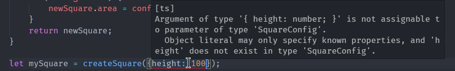

# TypeScript

為什麼需要了解 TypeScript 呢? 因為我們會用 TypeScript 來開發 Angular 應用程式，基於這個理由，我們得了解這個由微軟開發出來的 TypeScript。

TypeScript 是什麼? 

> TypeScript is a typed superset of JavaScript that compiles to plain JavaScript.
>
> Any browser. Any host. Any OS. Open source


這一個章節，我們會詳細的介紹 TypeScript 的功能


##  Basic Types

任何程式語言，都要去掌握該語言能使用的資料型別，TypeScript 也不例外，由於 TypeScript 的本質是 JavaScript，所以基本型別跟 JavaScript 是一樣的，但  TypeScript 提供更多的型別可以讓我們在開發時更加的方便。

### Boolean

單純的資料型別，只有 `true` 和 `false ` 兩種狀態，在 JavaScript 與 TypeScript 內的型別為 `boolean`

```typescript
let isDone: boolean = false;
```

### Number

數字型別在 JavaScript 或是在 TypeScript 裡，皆為浮點數型態，型別為 `number`

```typescript
let decimal: number = 6;
let hex: number = 0xf00d;
let binary: number = 0b1010;
let octal: number = 0o744
```

### String

TypeScript 的文字可以用單引號 (`'`) 或是 雙引號來表示 (`"`)，但通常文字格式建議使用單引號來表示文字形資料

```typescript
let color: string = "blue";
color = 'red';
```

另外一種表示文字的方式，稱為 `template strings` ，這種的表示方式是使用反單引號搭配 `${ expr } ` 來顯示變數

```typescript
let fullName: string = `Bob Bobbington`;
let age: number = 37;
let sentence: string = `Hello, my name is ${ fullName }.

I'll be ${ age + 1 } years old next month.`;
```

上述的寫法等同於以下寫法

```typescript
let sentence: string = "Hello, my name is " + fullName + ".\n\n" +
    "I'll be " + (age + 1) + " years old next month.";
```

### Array

TypeScript 的陣列表示，可以像 JavaScript 一樣，使用 `[]` ，當然也可以指定陣列型別

```typescript
let list: number[] = [1, 2, 3];
```

另外一種表示方式

```typescript
let list: Array<number> = [1, 2, 3];
```

### Tuple

Tuple 允許定義一個型別陣列，用來定義陣列內每一個元素的型別。

```typescript
// Declare a tuple type
let x: [string, number];
// Initialize it
x = ["hello", 10]; // OK
// Initialize it incorrectly
x = [10, "hello"]; // Error
```

TypeScript 很聰明的可以判斷目前所選取的資料的型別，如果使用到不屬於該型別可以使用的函數時，在開發時就會顯示錯誤提示

```typescript
console.log(x[0].substr(1)); // OK
console.log(x[1].substr(1)); // Error, 'number' does not have 'substr'
```

同樣的， TypeScript 也可以檢查在設定變數資料時，如果餵與的資料型別與原始定義的資料型別不符合時，一樣會出現錯誤提示

```typescript
x[3] = "world"; // OK, 'string' can be assigned to 'string | number'

console.log(x[5].toString()); // OK, 'string' and 'number' both have 'toString'

x[6] = true; // Error, 'boolean' isn't 'string | number'
```

### Enum

Enum 是另外一個有寫過後端的人，非常喜歡的一種型別，TypeScript 當然也支援這個型別

```typescript
enum Color {Red, Green, Blue}
let c: Color = Color.Green;
```

如果沒有指定初始的資料時，預設會從 0 開始往下編，但如果一開始用給予初始值時，就會從初始值往後編

```typescript
enum Color {Red = 1, Green, Blue}
let c: Color = Color.Green;
```

另外一種情境是，每一個選項都分別代表不同的值，這時就需要將每一個選項都賦予代表的數值

```typescript
enum Color {Red = 1, Green = 2, Blue = 4}
let c: Color = Color.Green;
```

假設我們有一個數值，想要透過某 Enum 型別去顯示所對應的選項文字是什麼時，可以用以下的方式達成

```typescript
enum Color {Red = 1, Green, Blue}
let colorName: string = Color[2];

alert(colorName);
```

而在 TypeScript 2.4 版，TypeScript 介紹了另外一種 String Enum 的表示法，可以使用文字作為 Enum 選項的初始值，範例如下

```typescript
enum Colors {
    Red = "RED",
    Green = "GREEN",
    Blue = "BLUE",
}
    
 console.log(Colors["RED"]); //output: Red
```

### Any

雖然 TypeScript 是賦予 JavaScript 型別的一種語言，但有時候我們使用的第三方套件沒有提供結構定義檔時，我們只能告訴 TypeScript 說，目前所使用的變數，他可能是任何型別，這樣在編譯的過程中，就不會跳出型別錯誤的提示，雖然很方便，在開發專案時，我們的建議還是少用 `any` 的型別

```typescript
let notSure: any = 4;
notSure = "maybe a string instead";
notSure = false; // okay, definitely a boolean

let notSure: any = 4;
notSure.ifItExists(); // okay, ifItExists might exist at runtime
notSure.toFixed(); // okay, toFixed exists (but the compiler doesn't check)

let prettySure: Object = 4;
prettySure.toFixed(); // Error: Property 'toFixed' doesn't exist on type 'Object'.

let list: any[] = [1, true, "free"];

list[1] = 100;
```

### Void

`void` 這型別是告訴 TypeScript 說，目前的這個函數不會回傳任何資料，或是變數只能接受 `null` 或 `undefined`

```typescript
function warnUser(): void {
    alert("This is my warning message");
}

let unusable: void = undefined;
```

### Null and Undefined

`null` 與 `undefined` 各屬獨立的型別，他需要搭配其他的型別，才能展現出本身的價值，TypeScript 在 2.0 版本之後，介紹了 `--strictNullChecks` 的參數，當開啟這個參數時，TypeScript 就會檢查是否有 `null` 或是 `undefined` 被指定到不符合或是不允許型別組合的情形發生。

例如說，有一個變數是 `string` 型別，當指定 undefined 至該變數時，TypeScript 就會有錯誤提示。

```typescript
// --strictNullChecks ON
let name: string;
name = undefined ; // Error

let name: string | undefined;
name = undefined ; // OK
name = null ; // Error

let name: string | undefined | null;
name = undefined ; // OK
name = null ; // ok
```

`string | undefined` 是型別集合的概念，這會在後面的內容內介紹到，這裡就先知道就好。

>  官方強烈的建議要將 `strictNullChecks` 的功能給打開，這樣可以在開發時期，避免許多不必要的錯誤。

### Never

`never` 是一個很特殊的型別，也是在 TypeScript 2.0 所新增的型別之一。`never` 代表**不會有任何值發生**。使用情境可以是用來判斷一個函數是否有涵蓋所有的可能性

```typescript
// Inferred return type is number
function move1(direction: "up" | "down") {
    switch (direction) {
        case "up":
            return 1;
        case "down":
            return -1;
    }
    return error("Should never get here");
}

function error(message: string): never {
    throw new Error(message);
}

// or Function returning never must have unreachable end point
function infiniteLoop(): never {
    while (true) {
    }
}
```

### Type assertions

TypeScript 提供了型別轉型的方法，使用方式有 `<T>` 或是 `as T`，`T` 為要轉換的型別，主要目的是告訴 TypeScript 說，「我很確定這個物件或是變數的型別是我說的這個，所以請使用我指定的型別做後續的判斷」

```typescript
let someValue: any = "this is a string";
let strLength: number = (<string>someValue).length;

// or use as-
let someValue: any = "this is a string";
let strLength: number = (someValue as string).length;
```


## Variable Declarations

ES6 (ES2015) 推出了兩種定義變數的新方式 `let` 和 `const` ，同時也建議不要再使用 `var` 來定義變數。

在介紹 `let` 與 `const` 之前，先解釋一下為什麼不建議再使用 `var` 的原因

### No more Var

在 ES5 以前的年代裡，都使用 `var` 來定義變數

```javascript
var a = 10;
```

當然也可以在 function 內使用 `var` 定義變數

```javascript
function f() {
    var message = "Hello, world!";

    return message;
}
```

或是這樣子定義變數，在 function 內所定義的其他 function 也可取得該變數的值

```javascript
function f() {
    var a = 10;
    return function g() {
        var b = a + 1;
        return b;
    }
}
var g = f();
g(); // 回傳 11
```

但是，這樣子的定義方式，當 function 結構越複雜時，就越難追蹤該變數值的變化，例如以下範例，當寫程式或是接手程式的人，對於 JavaScript 的特性不熟悉時，就會有迷惑的情形發生

```javascript
function f() {
    var a = 1;

    a = 2;
    var b = g();
    a = 3;

    return b;

    function g() {
        return a;
    }
}

f(); // returns '2'
```

而 `var` 還有另外一個奇怪的特性，就是 `scoping rule`，其實嚴格的說，應該是 JavaScript Hoisting 的特性造成的，根據 MDN 的解釋

> 提升 ( Hoisting ) 是您在 JavaScript 文檔中找不到的項目。提升是在 JavaScript 中需要思考程式片段的前後關係（特別是於創建和執行階段）通常是如何進行的地方，而且，提升可能會引起誤解。例如，提升使變數和函數的宣告被移動到您編寫的程式區塊頂端，但這並非發生於您編寫程式時，此發生於編譯階段，變數和函數的宣告提升會於放入記憶體中時處理，但在您編寫的程式碼中，仍然保留於您所鍵入的位置。

簡單的說，變數或是函數的宣告，都會自動被提升到函數或是程式碼的最上面，這個規則有好有壞，先說好的部分

```javascript
catName("Chloe");

function catName(name) {
  console.log("My cat's name is " + name);
}
```

上列的程式碼，即使函數是在呼叫函數之後才定義的，基於`提升`原則，這段程式碼還是可以正常運作的

但是，以下的程式碼範例就是顯示 `提升` 原則造成的思考邏輯上的混淆

```javascript
function f(shouldInitialize: boolean) {
    if (shouldInitialize) {
        var x = 10;
    }
    return x;
}

f(true);  // returns '10'
f(false); // returns 'undefined'
```

上列的程式碼在 JavaScript 的編譯器裡面，會被轉換成這樣，也就能解釋為什麼第二次呼叫時，會回傳 `undefined` 了

```javascript
function f(shouldInitialize: boolean) {
    var x;
    if (shouldInitialize) {
        x = 10;
    }
    return x;
}
```

簡單的說，用 `var` 定義的變數，沒有真正的 `scope` 觀念，`var` 所認知的 `scoping` 定義是根據函數為 `scoping` 的界線，有人稱之為 `function-scoping`，這就延伸出另外一個很常見的錯誤，**var in for loop**

```javascript
function sumMatrix(matrix: number[][]) {
    var sum = 0;
    for (var i = 0; i < matrix.length; i++) {
        var currentRow = matrix[i];
        for (var i = 0; i < currentRow.length; i++) {
            sum += currentRow[i];
        }
    }

    return sum;
}

// or

for (var i = 0; i < 10; i++) {
    setTimeout(function() { console.log(i); }, 100 * i);
}
```

這兩段程式碼跑出來的結果，是我們真正所預期看到的結果嗎? 可以自己跑看看就知道了。

這也是為什麼在 ES6 以後的變數定義，不建議使用 `var` 而一律使用 `let`  或是 `const`來定義變數了。


### let

`let` 的使用方式與 `var` 的用法是一樣的

```typescript
let hello = "Hello!";
```

有以下幾點的差異性

1.  **Scoping**，`let` 屬於 `block-scoping`，意思是，在區塊內定義的的變數，不會去影響到區塊以外的變數，但可以內層可以使用外層所定義的變數。

```typescript
function f(input: boolean) {
    let a = 100;

    if (input) {
        // 能可以正常的存取 'a' 
        let b = a + 1;
        return b;
    }

    // 錯誤: 'b' 不存在 
    return b;
}
```

2. **提升**， `let` 不會被提升到最上面，這表示要使用任何變數都必須先定義才可以使用

```typescript
a++; // a 尚未定義，為不合法使用
let a;
```

3. **重複定義**，`var`  允許相同的變數重複定義，但是 `let` 就不允許這情形發生了

   ```typescript
   let x = 10;
   let x = 20; // 錯誤: 在相同的 scope 下不能重複定義 'x'

   function f(x) {
       let x = 100; // 錯誤: 引數已經定義過 'x'
   }

   function g() {
       let x = 100;
       var x = 100; // 錯誤: 不能有兩種宣告 'x' 的方式
   }
   ```

我們現在回頭看剛剛使用 `var` 所寫的函數，當改用 `let` 時，會不會正常的運作

```typescript
function sumMatrix(matrix: number[][]) {
    let sum = 0;
    for (let i = 0; i < matrix.length; i++) {
        var currentRow = matrix[i];
        for (let i = 0; i < currentRow.length; i++) {
            sum += currentRow[i];
        }
    }

    return sum;
}

// or

for (let i = 0; i < 10; i++) {
    setTimeout(function() { console.log(i); }, 100 * i);
}
```

### const

`const` 就如字面意思，是用來定義常數的，當常數定義後，就不能再設定新的值，所以在宣告常數變數時，必須同時間賦予值

```typescript
const numLivesForCat = 9;
const kitty = {
    name: "Aurora",
    numLives: numLivesForCat,
}

// 這樣子改變物件內容是 okey 的
kitty.name = "Rory";
kitty.numLives--;
```

不能這樣子使用 `const`，錯誤示範

```typescript
// 錯誤範例1
const kitty = {
    name: "Aurora",
    numLives: numLivesForCat,
}
// 不能重新給予新值
kitty = {
    name: "Danielle",
    numLives: numLivesForCat
};

// 錯誤範例2
const kitty;
kitty = {
    name: "Danielle",
    numLives: numLivesForCat
};
```

###  Destructuring

`Destructuring` 是 ES2015 介紹的另外一個新功能，也可以稱為`解構賦值 (Destructuring Assignment)`，有兩種解構

1. 陣列

   ```typescript
   let input = [1, 2];
   let [first, second] = input;
   console.log(first); // outputs 1
   console.log(second); // outputs 2
   ```

   當然原本的 `input[0]` 的寫法依然可以好好的工作，只是解構賦值寫法不會覺得很簡潔帥氣嗎?

   另外一種應用方式，就是當作函數的引數使用

   ```typescript
   function f([first, second]: [number, number]) {
       console.log(first);
       console.log(second);
   }
   f([1, 2]);
   ```

2. 物件

   物件也可以跟陣列一樣，使用解構賦值的方式

   ```typescript
   let o = {
       a: "foo",
       b: 12,
       c: "bar"
   };
   let { a, b } = o;

   ({ a, b } = { a: "baz", b: 101 });
   ```

   這裡有一個地方需要注意的是，因為 `{}` 預設會被視為 `block` ，所以需要搭配 `()` 才可以正常使用物件解構賦值

   物件的解構還有其他的技巧，例如，可以在解構賦值的過程中，重新命名新的變數名稱

   ```typescript
   let { a: newName1, b: newName2 } = o;

   // 等同於
   let newName1 = o.a;
   let newName2 = o.b;
   ```

   當函數引數為物件時，有時我們會將其中一個屬性設為非必要，而這時候我們可以使用解構賦值的方式，賦予預設值

   ```typescript
   function keepWholeObject(wholeObject: { a: string, b?: number }) {
       let { a, b = 1001 } = wholeObject;
   }
   ```

### Spread

`Spread` 的語法是 `…`，就是三個點。這個 Spread 的運算式，適用於陣列與物件，(須留意 Object Spread 是在 TypeScript 2.1 版以後才支援)，Spread 運算式的功能是將一個陣列轉換成另外一個新陣列，可以說是 Destructuring 功能相反

```typescript
let first = [1, 2];
let second = [3, 4];
let bothPlus = [0, ...first, ...second, 5];

// object 
let merged = { ...foo, ...bar, ...baz };
let obj = { x: 1, y: "string" };
var newObj = {...obj, z: 3, y: 4}; // { x: number, y: number, z: number }
```

但還是有些限制，例如遇到某物件內有屬性及函數，透過 `spread` 運算式，只能取出該物件內的屬性。

```typescript
class C {
  p = 12;
  m() {
  }
}
let c = new C();
let clone = { ...c };
clone.p; // ok
clone.m(); // error!
```

## Interface

型別檢查是 TypeScript 核心精神之一，尤其是著重於資料結構描述，稱為 `duck typing` 或是 `structural subtyping`。Interface 是 TypeScript 提供一種用來描述資料結構的強大方法，Interface 只會存在於開發階段，並不會隨著編譯一起輸出至 JavaScript。

還記得在一開始介紹基本型別的地方，我們可以在函數定義所接受的引數型別為何，如果引數的型別是一個物件型態，這時會怎樣定義呢? 簡單的想應該會是這樣

```typescript
function printLabel(labeledObj: {label: string}){
    console.log(labeledObj.label);
}

let myObj = { age: 10, label: 'Size 10 Object'};
printLabel(myObj);
```

上述範例程式碼的  `{label: string} ` 就是用來描述 `labeledObj` 的資料結構，我們當可以用 interface 的方式來替換原本的描述方式，型別檢查機制仍可以正確地進行型別檢查

```typescript
interface LabeledValue {
  label: string
}

function printLabel(labeledObj: LabeledValue){
    console.log(labeledObj.label);
}

let myObj = { age: 10, label: 'Size 10 Object'};
printLabel(myObj);
```

### Optional Properties

定義 interface 時，有時會遇到某些欄位可有可無的狀況，要在 interface 表示這種狀況，可以使用 `?` 來描述屬性，這樣型別檢查時，就不會強求該屬性存在與否。

```typescript
interface SquareConfig {
    color?: string;
    width?: number;
}

function createSquare(config: SquareConfig): {color: string; area: number} {
    let newSquare = {color: "white", area: 100};
    if (config.color) {
        newSquare.color = config.color;
    }
    if (config.width) {
        newSquare.area = config.width * config.width;
    }
    return newSquare;
}

let mySquare = createSquare({color: "black"});
```

TypeScript 2.4版介紹了一個新功能，`weak type detection` ，Type-Checker 會強制檢查所傳入的值，如果傳入的引數不符合 interface 的定義，不論是缺少或多於的屬性，TypeScript 都會顯示錯誤訊息。拿上述的範例來說，如果 `createSquare` 傳入的物件屬性沒有符合 interface 定義， TypeScript 會抱怨給你知道

```typescript
interface SquareConfig {
    color?: string;
    width?: number;
}

function createSquare(config: SquareConfig): {color: string; area: number} {
   ...
}

let mySquare = createSquare({height: 10}); // 錯誤訊息如下
```



因為這是 2.4 版本的新功能，或許會造成現有程式碼的發生錯誤，所以有一些建議的方法可以繞過或避免錯誤

1. 如果屬性真的存在，請宣告該屬性
2. 新增 `index signature`  到 weak type 裡，例如：[propName: string]: {}
3. 使用`Type Assertion`，例如：opts as Options

### Readonly properties

在函數內可以定義常數，在 interface 裡，`readonly` 的功能就與 `const`的功能是一樣的，當實作該 interface 時，只允許初始化時賦予屬性資料，之後就不能做任何修改。而 `readonly` 與 `const` 的差別是，屬性使用`readonly`，變數使用`const` 。

```typescript
interface Point {
    readonly x: number;
    readonly y: number;
}

let p1: Point = { x: 10, y: 20 };
p1.x = 5; // 錯誤!
```

TypeScript 也提供唯獨陣列 ，`ReadonlyArray<T>` ，這也是陣列，只是當建立後就不能做任何的修改了

```typescript
let a: number[] = [1, 2, 3, 4];
let ro: ReadonlyArray<number> = a;
ro[0] = 12; // 錯誤!
ro.push(5); // 錯誤!
ro.length = 100; // 錯誤!
a = ro; // 錯誤!
```

但可以透過 type assertion 的方式將 `ReadonlyArray<T>` 轉換回一般可異動的陣列

```typescript
a = ro as number[];
```

### Function Type

interface 不只有定義屬性，也可以用來定義函數，interface 針對函數的定義有分兩種，一種是單純函數定義，如下列範例

```typescript
interface SearchFunc {
    (source: string, subString: string): boolean;
}

let mySearch: SearchFunc;
mySearch = function(source: string, subString: string) {
    let result = source.search(subString);
    return result > -1;
}
```

實作引數名稱不需與 interface 內所定義的名稱相同，TypeScript 的型別檢查只在意引數及回傳值的型別是否正確。

### Indexable Types

如同字面上的意思，這是定義索引陣列取值方式，換句話說，就是定義一個 KeyValue 的資料集

```typescript
interface StringArray {
    [index: number]: string;
}

let myArray: StringArray;
myArray = ["Bob", "Fred"];

let myStr: string = myArray[0];
```

還記得在 `Optional Properties` 節有提到修正 `weak type detection` 錯誤的修正方法之一，就是使用 `[propName: string]: string`，這種表示法就是 `Indexable Types` 。要從一個物件取出資料時，就必須吻合所設定的索引方式

```typescript
interface myClassList {
    [class: string]: boolean;
}

let ngClassList: myClassList;
ngClassList = {'blue': true, 'bold': true};
```

### Class Types

interface 也可以用來規範 Class ，這部分如果有寫過強型別後端的人就知道，如果要實作 IoC ，就必須透過 interface 來定義 Class 的內容，而 TypeScript 裡的 Class Types Interface 也是一樣的功能

```typescript
interface ClockInterface {
    currentTime: Date;
    setTime(d: Date);
    new (hour: number, minute: number);
}

class Clock implements ClockInterface {
    currentTime: Date;
    setTime(d: Date) {
        this.currentTime = d;
    }
    constructor(h: number, m: number) { }
}
```

### Extending Interfaces

就跟 Class  一樣，Interface 也可以被擴充，擴充可以讓 Interface 更加有彈性，提供重複利用率

```typescript
interface Shape {
    color: string;
}

interface Square extends Shape {
    sideLength: number;
}

let square = <Square>{};
square.color = "blue";
square.sideLength = 10;
```

Interface 可以繼承多個 interface，有點積木的感覺

```typescript
interface Shape {
    color: string;
}

interface PenStroke {
    penWidth: number;
}

interface Square extends Shape, PenStroke {
    sideLength: number;
}

let square = <Square>{};
square.color = "blue";
square.sideLength = 10;
square.penWidth = 5.0;
```

### Hybrid Types 

所謂的 HyBrid Types 是將 Function Types 與 Class Types 的定義模式混合在一起，這個都要感謝 JavaScript 的語言特性，讓這一切都變得有趣。就先看一下定義方式與實作方式吧，通常會在與第三方套件溝通時，才會有機會使用到這種設計模式。

```typescript
interface Counter {
    (start: number): string;
    interval: number;
    reset(): void;
}

function getCounter(): Counter {
    let counter = <Counter>function (start: number) { };
    counter.interval = 123;
    counter.reset = function () { };
    return counter;
}

let c = getCounter();
c(10);
c.reset();
c.interval = 5.0;
```

### Interfaces Extending Classes

好吧，我承認這種組合很奇怪，通常都是 Class 繼承 interfaces，但為什麼會有這樣子的情形發生呢？先看一下範例程式碼

```typescript
class Fenton {
    public height = 'Tall';
    getHeight() {
        return this.height;
    }
}

interface IFenton extends Fenton {
    getWeight() : string;
}

class FentonLike implements IFenton {
    public height = 'Medium';
    getHeight() {
        return this.height;
    }
    getWeight() {
        return 'Don\'t ask';
    }
}
```

TypeScript 遇到 interface 繼承 classes 的狀態時，會自動將 classes 轉換成 interface 模式，所以當實作 interface 時，就必須完整實作 interface 及其繼承的 class。

所以 interface 繼承 classes 是一種將 class 轉換成 interface 後的一種擴充手法。


## Classes

在 ES2015 出現之前，傳統的 JavaScript 使用  Functions 和 prototype-based 模式來設計可重複使用的物件，這種設計模式讓習慣物件導向的後端人員想要學習 JavaScript 時，需要踏過很大的門檻跟心魔的煎熬。自從 ES2015 介紹 Class 的設計模式，這讓熟悉物件導的開發人員，可以很快速使用 Class-based 的模式開發 JavaScript。

即使 JavaScript 已經推出新功能規格的 ES2015 及以後，並不代表瀏覽器是支援的，而 TypeScript 能幫我們解決這部分的困惱，TypeScript 可以轉譯成瀏覽器可以支援的 ES5 的版本；我們可以使用 ES2015 及以後規格語法開發應用程式，剩下的工作就交給 TypeScript。

### Classes

有寫過 Java 或 c# 的開發人員，對於以下的語法格式應該是熟悉的

```typescript
class Greeter {
    greeting: string;
    constructor(message: string) {
        this.greeting = message;
    }
    greet() {
        return "Hello, " + this.greeting;
    }
}

let greeter = new Greeter("world");

```

我們所預期 Class 應有的特性，例如說繼承，實作介面、存取修飾詞，靜態等，TypeScript 都有提供

###Inheritance

繼承是物件導向裡一個重要的觀念。幾個重點先知道

1. `extends` 是繼承的關鍵字
2. `super` 會執行底層 constructor
3. 函數會由上往下執行

```typescript
class Animal {
    name: string;
    constructor(theName: string) { this.name = theName; }
    move(distanceInMeters: number = 0) {
        console.log(`${this.name} moved ${distanceInMeters}m.`);
    }
}

class Snake extends Animal {
    constructor(name: string) { super(name); }
    move(distanceInMeters = 5) {
        console.log("Slithering...");
        super.move(distanceInMeters);
    }
}

class Horse extends Animal {
    constructor(name: string) { super(name); }
    move(distanceInMeters = 45) {
        console.log("Galloping...");
        super.move(distanceInMeters);
    }
}

let sam = new Snake("Sammy the Python");
let tom: Animal = new Horse("Tommy the Palomino");

sam.move(); 
// Slithering...
// Sammy the Python moved 5m.

tom.move(34);
// Galloping...
// Tommy the Palomino moved 34m.
```

上面的範例程式碼裡，有一個 `Animal` 的底層物件，而 `Snake` 及 `Horse` 是繼承 `Animal` 物件的，這表示即使 `Snake` 和 `Horse` 已經擁有 `Animal` 的 `move` 函數和 `name` 的屬性。

子類別物件如果有 `constructor` 時，就必須呼叫 `super` 來執行被繼承物件的 `constructor`。

另外一點要留意的是，子類別物件有實作與繼承物件相同函數時，兩個函數都會被執行，執行的順序是從子類別物件先執行後在執行繼承物件的函數。


### 存取修飾詞

public、private、protected、readonly 皆屬於存取修飾詞，在物件導向設計下，透過存取修飾詞來決定有哪些內容是可以對外開發，及對外開放的範圍。

※注意：存取修飾詞的功能僅限於開發模式

#### Public by default

public 為預設的存取修飾詞，這表示有沒有標明 `public` 是沒有差別的。

```typescript
class Animal {
    public name: string;
    public constructor(theName: string) { this.name = theName; }
    public move(distanceInMeters: number) {
        console.log(`${this.name} moved ${distanceInMeters}m.`);
    }
}
```

#### Private

`private` 限制了外部對於存取物件屬性與函數的能力，在開發時 TypeScript 所提供的 intellisense 功能，會看不到設定為 private 的屬性或是函數。

```typescript
class Animal {
    private name: string;
    constructor(theName: string) { this.name = theName; }
}

new Animal("Cat").name; // 錯誤: 'name' 是私有屬性
```

#### Protected

protected 與 private 很類似，protected 是開放給繼承物件使用，但還不到 public 等級

```typescript
class Person {
    protected name: string;
    constructor(name: string) { this.name = name; }
}

class Employee extends Person {
    private department: string;

    constructor(name: string, department: string) {
        super(name);
        this.department = department;
    }

    public getElevatorPitch() {
        return `Hello, my name is ${this.name} and I work in ${this.department}.`;
    }
}

let howard = new Employee("Howard", "Sales");
console.log(howard.getElevatorPitch());
console.log(howard.name); // 錯誤: 無法存取 name 屬性
```

如果 constructor 也標示為 protected 時，表示該物件不能單獨被建立，只能被用於繼承用途。

```typescript
class Person {
    protected name: string;
    protected constructor(theName: string) { this.name = theName; }
}

// Employee 可以繼承 Person 物件
class Employee extends Person {
    private department: string;

    constructor(name: string, department: string) {
        super(name);
        this.department = department;
    }

    public getElevatorPitch() {
        return `Hello, my name is ${this.name} and I work in ${this.department}.`;
    }
}

let howard = new Employee("Howard", "Sales");
let john = new Person("John"); // 錯誤: The 'Person' constructor is protected
```

#### Readonly

`readonly` 在 interface 小節有介紹過， `readonly` 是用來定義屬性，讓屬性只能在宣告時賦予值，之後就不能再行變更了

```typescript
class Octopus {
    readonly name: string;
    readonly numberOfLegs: number = 8;
    constructor (theName: string) {
        this.name = theName;
    }
}
let dad = new Octopus("Man with the 8 strong legs");
dad.name = "Man with the 3-piece suit"; // 錯誤! name 屬唯獨屬性.
```

#### Parameter properties

TypeScript 提供一個快速定義屬性的方法，我們可以在 constructor 時，就定義屬性，適用於所有的存取修飾詞

```typescript
class Octopus {
    readonly numberOfLegs: number = 8;
    constructor(readonly name: string, public age: number) {
    }
}
```

### Accessors

一般的情況，屬性的只能單純的接受回傳值，如果我們想要在存取屬性時做加工呢，就必須透過 `set` 與 `get` 的幫忙，這兩者可以個別存在。

```typescript
class Employee {    
	private firstName: string;
    private lastName: string;
  
    get fullName(): string {
        return `My Name is ${this.firstName} ${this.lastName}`;
    }
  	
    set fullName(firstName: string, lastName: string){
        this.firstName = firstName;
        this.lastName = lastName;
    }
}

let employee = new Employee('Bob', 'Smith');
console.log(employee.fullName); // 輸出: My Name is Bob Smith

```

另一種使用情境是只有 `get` 出現，等同於 `readonly` 的效果， fullName 屬性只能讀取，不能存入。

```typescript
class Employee {    
	constructor(private firstName: string, private lastName: string){}
  
    get fullName(): string {
        return `My Name is ${this.firstName} ${this.lastName}`;
    }
}

let employee = new Employee('Bob', 'Smith');
console.log(employee.fullName); // 輸出: My Name is Bob Smith

```

### Static Properties

靜態屬性是物件不需要被建立也可以被存取的屬性。

```typescript
class Grid {
    static origin = {x: 0, y: 0};
    calculateDistanceFromOrigin(point: {x: number; y: number;}) {
        let xDist = (point.x - Grid.origin.x);
        let yDist = (point.y - Grid.origin.y);
        return Math.sqrt(xDist * xDist + yDist * yDist) / this.scale;
    }
    constructor (public scale: number) { }
}
```

我們可以看出靜態屬性與一般屬性的差異，一般屬性的存取是透過 `this` ，而靜態屬性是透過物件名稱 ( `Grid.origin` )，`static` 也適用於函數。

### Abstract Classes

`Abstract Classes` 一定是用來繼承使用，不能直接被建立。`Abstract classes` 具有 class 與 interface 兩者的特性，`abstract` 關鍵字是設定必須實作的函數 ( 功能與 interface 相同)

```typescript
abstract class Department {

    abstract printMeeting(): void; // must be implemented in derived classes
    constructor(public name: string) {
    }

    printName(): void {
        console.log("Department name: " + this.name);
    }   
}

class AccountingDepartment extends Department {

    constructor() {
        super("Accounting and Auditing"); // constructors in derived classes must call super()
    }

    printMeeting(): void {
        console.log("The Accounting Department meets each Monday at 10am.");
    }

    generateReports(): void {
        console.log("Generating accounting reports...");
    }
}
```

### 應用技巧

#### static property

修改 static property 的方式

```typescript
class Greeter {
    static standardGreeting = "Hello, there";
    greeting: string;
    greet() {
        if (this.greeting) {
            return "Hello, " + this.greeting;
        }
        else {
            return Greeter.standardGreeting;
        }
    }
}

let greeter1: Greeter;
greeter1 = new Greeter();
console.log(greeter1.greet()); // 輸出: Hello, there

let greeterMaker: typeof Greeter = Greeter;
greeterMaker.standardGreeting = "Hey there!";

let greeter2: Greeter = new greeterMaker();
console.log(greeter2.greet()); // 輸出: Hey, there!
```


#### Using a class as an interface

這技巧在 interface 有提過，當 interface 繼承 class 時，該 class 會被轉換成 interface 模式，相關屬性函數都會被繼承，但原本實作功能就不會保留了。

```typescript
class Point {
    x: number;
    y: number;
}

interface Point3d extends Point {
    z: number;
}

let point3d: Point3d = {x: 1, y: 2, z: 3};
```


## Functions

## Generics

## Enums

## Type Inference

## Type Compatibility

## Advanced Types

## Symbols

## Iterators and Generators

## Modules

## Decorators


