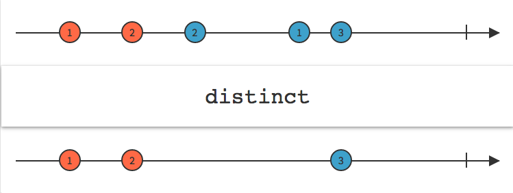

# Filtering Operators

## debounce

根據另一個 observable 來決定延遲多久取資料


**使用介面**

```typescript
debounce(durationSelector: function(value: T): SubscribableOrPromise): Observable
```

**使用範例**

```typescript
var clicks = Rx.Observable.fromEvent(document, 'click');
var result = clicks.debounce(() => Rx.Observable.interval(1000));
result.subscribe(x => console.log(x));
```


## debounceTime

根據設定時間決定延遲多久取資料


**使用介面**

```typescript
debounceTime(dueTime: number, scheduler: Scheduler): Observable
```

**使用範例**

```typescript
var clicks = Rx.Observable.fromEvent(document, 'click');
var result = clicks.debounceTime(1000);
result.subscribe(x => console.log(x));
```

## audit

根據 observable 所設定取資料間隔時間，取得最新發生的資料


**使用介面**

```typescript
audit(durationSelector: function(value: T): SubscribableOrPromise): Observable<T>
```

**使用範例**

```typescript
Observable.interval(1000)
          .take(10)
          .audit(()=> Observable.interval(1200))
          .subscribe(value => console.log(value)) // 輸出：1, 3, 5,7
```

## auditTime

根據所設定取資料間隔時間，取得最新發生的資料


**使用介面**

```typescript
 auditTime(duration: number, scheduler: Scheduler): Observable<T>
```

使用範例

```typescript
Observable.interval(1000)
          .take(10)
          .audit(1200)
          .subscribe(value => console.log(value)) // 輸出：1, 3, 5,7
```

## sample

當 notifier 發出值時，則取得最新的資料


**使用介面**

```typescript
sample(notifier: Observable<any>): Observable<T>
```

**使用範例**

```typescript
var seconds = Rx.Observable.interval(1000);
var clicks = Rx.Observable.fromEvent(document, 'click');
var result = seconds.sample(clicks);
result.subscribe(x => console.log(x));
```

## sampleTime

依時間間隔取得最新的資料


**使用介面**

```typescript
sampleTime(period: number, scheduler: Scheduler): Observable<T>
```

**使用範例**

```typescript
var clicks = Rx.Observable.fromEvent(document, 'click');
var result = clicks.sampleTime(70);
result.subscribe(x => console.log(x));
```

## throttle

## throttleTime

## distinct

過濾掉相同的值


**使用介面**

```typescript
distinct(keySelector: function, flushes: Observable): Observable
```

**使用範例**

```typescript
Observable.of(1, 1, 2, 2, 2, 1, 2, 3, 4, 3, 2, 1)
    .distinct()
    .subscribe(x => console.log(x));  // 1, 2, 3, 4
```

```typescript
interface Person {
    age: number,
    name: string
 }
 
 Observable.of<Person>(
     { age: 4, name: 'Foo'},
     { age: 7, name: 'Bar'},
     { age: 5, name: 'Foo'})
     .distinct((p: Person) => p.name)
     .subscribe(x => console.log(x));
```

## distinctUntilChanged

消除重複值到下一次資料不相同時

**使用介面**

```typescript
distinctUntilChanged(compare: function): Observable
```

**使用範例**

```typescript
Observable.of(1, 1, 2, 2, 2, 1, 1, 2, 3, 3, 4)
  .distinctUntilChanged()
  .subscribe(x => console.log(x)); // 1, 2, 1, 2, 3, 4
```

```typescript
interface Person {
   age: number,
   name: string
}
// 也可以給予函式作為比較差異的基準
Observable.of<Person>(
    { age: 4, name: 'Foo'},
    { age: 7, name: 'Bar'},
    { age: 5, name: 'Foo'})
    { age: 6, name: 'Foo'})
    .distinctUntilChanged((p: Person, q: Person) => p.name === q.name)
    .subscribe(x => console.log(x));

// displays:
// { age: 4, name: 'Foo' }
// { age: 7, name: 'Bar' }
// { age: 5, name: 'Foo' }
```


## distinctUntilKeyChanged

消除重複值到下一次設定比較欄位的資料不相同時

**使用介面**

```typescript
distinctUntilKeyChanged(key: string, compare: function): Observable
```

**使用範例**

```typescript
interface Person {
   age: number,
   name: string
}
// 也可以給予函式作為比較差異的基準
Observable.of<Person>(
    { age: 4, name: 'Foo'},
    { age: 7, name: 'Bar'},
    { age: 5, name: 'Foo'})
    { age: 6, name: 'Foo'})
   .distinctUntilKeyChanged('name', (x: string, y: string) => x.substring(0, 3) === y.substring(0, 3))
    .subscribe(x => console.log(x));

// displays:
// { age: 4, name: 'Foo' }
// { age: 7, name: 'Bar' }
// { age: 5, name: 'Foo' }
```

## elementAt

取得特定索引位置的資料


**使用介面**

```typescript
elementAt(index: number, defaultValue: T): Observable
```

**使用範例**

```typescript
interface Person {
    age: number,
    name: string
 }
 
 Observable.of<Person>(
     { age: 4, name: 'Foo'},
     { age: 7, name: 'Bar'},
     { age: 5, name: 'Foo'})
     .elementAt(1)
     .subscribe(x => console.log(x)); // 輸出：{ age: 7, name: 'Bar'}
```

## ignoreElements

忽略所有送出資料


**使用介面**

```typescript
ignoreElements(): Observable
```

**使用範例**

```typescript
const data = [1, 2, 3, 4, 5];
Observable.from(data)
          .ignoreElements()
          .subscribe(value => console.log(value)); // 不會輸出任何資料
```

## filter

只有符合條件的資料可以通過


**使用介面**

```typescript
filter(predicate: function(value: T, index: number): boolean, thisArg: any): Observable
```

**使用範例**

```typescript
const data = [1, 2, 3, 4, 5, 6, 7, 8, 9, 10];
Observable.from(data)
          .filter(x => x < 5)
          .subscribe(value => console.log(value)); // 輸出：1,2,3,4
```

## first

取得符合條件的第一筆資料


**使用介面**

```typescript
first(predicate: function(value: T, index: number, source: Observable<T>): boolean, resultSelector: function(value: T, index: number): R, defaultValue: R): Observable<T | R>
```

**使用範例**

```typescript
const data = [1, 2, 3, 4, 5, 6, 7, 8, 9, 10];
Observable.from(data)
          .first(x => x > 5)
          .subscribe(value => console.log(value)); // 輸出: 6
```

## last

取得符合條件的最後一筆資料


**使用介面**

```typescript
last(predicate: function): Observable
```

**使用範例**

```typescript
const data = [1, 2, 3, 4, 5];
Observable.from(data)
          .last(x => x > 3)
          .subscribe(value => console.log(value)); // 輸出：5
```

## single

只允許一筆資料發生，如果有兩筆以上的資料，就會觸發錯誤


**使用介面**

```typescript
single(predicate: Function): Observable<T>
```

**使用範例**

```typescript
const data = [1, 2, 3, 4, 5];
Observable.from(data).single().subscribe(
    value => console.log(value), 
      err => console.error(err)); // 輸出: Sequence contains more than one element
```

## skip

忽略 n 筆資料後再輸出


**使用介面**

```typescript
skip(count: Number): Observable
```

**使用範例**

```typescript
const data = [1, 2, 3, 4, 5];
Observable.from(data)
          .skip(3)
          .subscribe(value => console.log(value)); // 輸出 4, 5
```

## skipUntil

忽略資料直到 notifier 發出資料


**使用介面**

```typescript
skipUntil(notifier: Observable): Observable<T>
```

**使用範例**

```typescript
Observable.interval(500)
    .take(10)
    .skipUntil(Observable.of('1').delay(3000))
    .subscribe(value => console.log(value)); // 輸出 5, 6, 7, 8, 9
```

## skipWhile

忽略資料直到不合條件時 發出資料


**使用介面**

```typescript
skipWhile(predicate: Function): Observable<T>
```

**使用範例**

```typescript
Observable.interval(500)
    .take(10)
    .skipWhile(value => value < 4)
    .subscribe(value => console.log(value)); // 輸出: 4, 5, 6, 7, 8, 9
```

## take

設定要取得的資料筆數，滿足則會完成 Observable


**使用介面**

```typescript
take(count: number): Observable<T>
```

**使用範例**

```typescript
Observable.interval(500)
    .take(5)    
    .subscribe(value => console.log(value)); // 輸出： 0, 1, 2, 3, 4
```

## takeLast

當 Observable 完成時，設定要取得最後所發生的 n 筆資料

**使用介面**

```typescript
takeLast(count: number): Observable<T>
```

**使用範例**

```typescript
const data = [1, 2, 3, 4, 5];
Observable.from(data)
    .takeLast(2)        
    .subscribe(value => console.log(value)); // 輸出: 4, 5
```

## takeUntil

持續取值直到 notifier 發生資料


**使用介面**

```typescript
takeUntil(notifier: Observable): Observable<T>
```

**使用範例**

```typescript
Observable.interval(500)
    .take(10)
    .takeUntil(Observable.of('1').delay(3000))
    .subscribe(value => console.log(value)); // 輸出：0, 1, 2, 3, 4
```

## takeWhile

持續取值直到不符合條件時


**使用介面**

```typescript
takeWhile(predicate: function(value: T, index: number): boolean): Observable<T>
```

**使用範例**

```typescript
Observable.interval(500)
    .take(10)
    .takeWhile(value => value < 4)
    .subscribe(value => console.log(value)); // 輸出：0, 1, 2, 3
```

