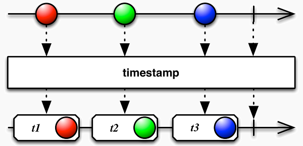
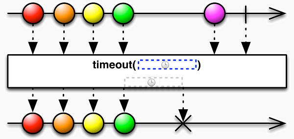

# Utility Operators

## do

可執行動作，但不會影響原本的 Observable


**使用介面**

```typescript
do(nextOrObserver: Observer | function, error: function, complete: function): Observable
```

**使用範例**

```typescript
Observable.fromEvent(document, 'click')
    .do(ev => console.log(ev))
    .map(ev => ev.clientX)
    .subscribe(x => console.log(x));
```

## delay

延遲資料發出

**使用介面**

```typescript
delay(delay: number | Date, scheduler: Scheduler): Observable
```

**使用範例**

```typescript
Observable.of('1')
          .delay(500)
          .subscribe(value=> console.log(value));
```

## delayWhen

延遲資料發出

**使用介面**

```typescript
delayWhen(delayDurationSelector: function(value: T): Observable, subscriptionDelay: Observable): Observable
```

**使用範例**

```typescript
Observable.of(1, 2, 3, 4, 5)
    .delayWhen(value => {return Observable.interval(Math.random() * 5000)})
    .subscribe(x => console.log(x));
```

## dematerialize

轉換 Notification　物件至各自所代表的值

**使用介面**

```typescript
 dematerialize(): Observable
```

**使用範例**

```typescript
var notifA = new Notification('N', 'A');
var notifB = new Notification('N', 'B');
var notifE = new Notification(
    'E', void 0, new TypeError('x.toUpperCase is not a function'));
Observable.of(notifA, notifB, notifE)
    .dematerialize()
    .subscribe(x => console.log(x), e => console.error(e));
/*
輸出:
A
B
error: x.toUpperCase is not a function
*/    
```

## finally

當 Observable 完成時，需要執行的動作
**使用介面**

```typescript
finally<T>(this: Observable<T>, callback: () => void): Observable<T>
```

**使用範例**

```typescript
Observable.of(1, 2, 3)
    .finally(() => {console.log('catch in finally operator')})
    .subscribe(value => console.log(value));
```

## let

取得原本的 Observable 並進行其他的動作，但此動作會影響原本的 Observable
**使用介面**

```typescript
let<T>(selector: Observable<T> => Observable<R>): Observable<R>;
```

**使用範例**

```typescript
Observable.of(1, 2, 3)
    .let((obs) => obs.map(x => x * 2))
    .subscribe(value => console.log(value));
// 輸出: 2, 4, 6    
```

## materialize

將資料轉換成 Notifications 型態

**使用介面**

```typescript
 materialize(): Observable<Notification<T>>
```

**使用範例**

```typescript
Observable.of(1, 2, 3).materialize().subscribe(value => console.log(value));
/*
輸出:
Notification { kind: 'N', value: 1, error: undefined, hasValue: true }​​​​​
Notification { kind: 'N', value: 2, error: undefined, hasValue: true }​​​​​
Notification { kind: 'N', value: 3, error: undefined, hasValue: true }​​​​​
Notification { kind: 'C', value: undefined, error: undefined, hasValue: false }​​​​​
*/
```

## timeInterval

記錄每一段執行的時間長度


**使用介面**

```typescript
timeInterval(scheduler: *): Observable<TimeInterval<any>> | WebSocketSubject<T> | Observable<T>
```

**使用範例**

```typescript
Observable.timer(0, 1000)
    .timeInterval()
    .map((x:{value, interval})=> {    
      return x.value + ':' + x.interval;
    })
    .take(5)
    .subscribe(value => console.log(value));
/* 輸出
0:0
1: 1002
2: 1000
3: 1001
4: 1000
*/    
```

## timestamp

記錄每一段執行的時間戳章


**使用介面**

```typescript
 timestamp(scheduler: *): Observable<Timestamp<any>> | WebSocketSubject<T> | Observable<T>
```

**使用範例**

```typescript
Observable.timer(0, 1000)
    .timestamp()
    .map((x: {value, timestamp}) => {      
      return x.value + ':' + x.timestamp;
    })
    .take(5)
    .subscribe(value => console.log(value));
```

## timeout

決定 timeout 時間，如果超過所設定時間，則進入 `error` 階段


**使用介面**

```typescript
 timeout(due: number, scheduler: Scheduler): Observable<R> | WebSocketSubject<T> | Observable<T>
```

**使用範例**

```typescript
Observable.timer(0, 1000)
          .timeout(500)
          .subscribe(
            value => console.log(value), // 輸出: 0
            err => console.log(err)); // 錯誤訊息: ​​​​​Timeout has occurred​​​​​ 
```

## timeoutWith

當發生超時錯誤時，使用 Observable 回傳另一個要執行的 Observable
**使用介面**

```typescript
timeoutWith(due: *, withObservable: *, scheduler: *): Observable<R> | WebSocketSubject<T> | Observable<T>
```

**使用範例**

```typescript
Observable.timer(0, 1000)
    .timeoutWith(500, Observable.of('timeout occur'))
    .subscribe(value => console.log(value));
// 輸出: 0, timeout occur    
```

## toArray

將資料串流彙整成一個陣列


**使用介面**

```typescript
toArray(): Observable<any[]> | WebSocketSubject<T> | Observable<T>
```

**使用範例**

```typescript
Observable.from([1, 2, 3])
          .toArray()
          .subscribe(value => console.log(value));
// 輸出: [1, 2, 3]          
```

## toPromise

將 Observable 轉換成 Promise

**使用介面**

```typescript
toPromise(PromiseCtor: *): Promise<T>
```

**使用範例**

```typescript
let source = Rx.Observable.of(42)
  .toPromise();
source.then((value) => console.log('Value: %s', value));
```

