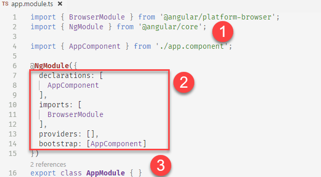
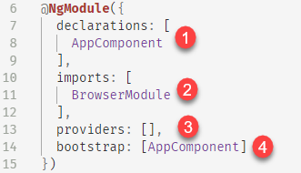

# NgModules

NgModules 可以根據功能性來組織應用程式的程式碼，讓應用程式的程式碼更容易整理及擴充。

NgModules 是一個 Class 掛上 `@NgModule` 裝飾器，`@NgMoudle` 接受一個 metadata 物件用來設定 `@NgModule`。

```typescript
@NgModule({
  // metadata
  ...
})
export class AppModule {}
```

## 模組化

對於組織程式或是擴充既有程式，模式化是一個很有效的方式，Angular 本身也是使用模組化的方式，將類似的功能整理在一起，例如：`FormsModule` 、 `HttpModule`  等，甚至第三方套件也採用一樣的模式做發佈，讓我們可以簡單的安裝並使用。

Angular 應用程式一定會有一個 NgModule，通稱為起始模組 ( root module )，我們可以將所有的 components、 directives、pipes、services 都在放這一個模組下，隨著時間業務規模成長，應用程式也會跟著成長，基於架構規劃效能等考量，我們就會將負責相同業務功能的程式碼重構至新的模組 ( feature module ) 裡，將重複使用的功能重構至共享模組 ( shared module ) ，甚至將核心功能重構至核心模組 ( core module )。

NgModule 的另外一個特性就是讀取模式，Angular 可以有延遲載入模組的功能，這樣的功能，可以在改善第一次載入應用程式的時間，但需要注意的是，起始模組本身是不能被延遲載入的，但其他的 feature module 是可以透過路由設定的方式達到延遲載入的效果。

到這裡，我們大致上了解了 NgModule 的用途是什麼，接下來就在深入的研究 NgModule 的內部細節及相關的注意事項

## The root AppModule

任何 Angular 應用程式一定會有一個根模組，通稱為 `AppModule` 且檔名會是 `app.module.ts`，透過 CLI 所建立的專案，一定會在 `src/app` 資料夾下看到 `app.module.ts` 這個檔案，預設看到的內容如下



1. 從別的模組 import 功能區塊
2. `@NgModule` 裝飾器所需的 metadata
3. module class 程式碼區塊

Metadata 內可以設定很多項目，預設的樣版如下



1. declarations：定義 component、directive、pipe 物件定義
2. imports：設定要載入的 NgModule 清單
3. providers：設定 service 等，Dependence Injection 所需要參考的資源來源
4. bootstrap：預設要啟動的 component 清單，只限起動模組專用

更進一步的說明每一區塊實際的功能

### declarations

如前面所說，這區塊是用來定義在這個模組下可以使用的 Component、Directive、Pipe，如果沒有定在此區塊，或在引用的 modules 裡沒有被輸出的話，Angular 編譯器會發出不認識某個元素標籤的錯誤訊息。所以不論是建立 Component、Directive 或 Pipe 時，記得要加到這區塊裡

不能加到這 declarations 區塊的內容有

1. Components、directives、pipes 只能被註冊於一個 NgModule 裡，不可重複註冊，例如 `NgModel`，因為當引用 `FormsModule` 時，`NgModel` 已經在 `FormsModule` 裡被註冊了。
2. Module Class
3. Service Class
4. 非 Angular 的 classes 或是 objects，如 strings、numbers、functions、entity models、configurations、business logic 和 helper classes。

#### directive 衝突?

假設重複註冊相同 `selector` 的 directive 時，Angular 會怎麼處理呢? 最後註冊者為贏家。如果有重複註冊相同 class 的 directive 時，Angular 會移除重複的項目。

須留意的是如果有相同 selector 但來自不同的 component 時， Angular 會報錯誤。

簡單避免 component 和 directive 的衝突問題，就是將 component 與 directive 包再 feature module 裡，因為 module 間的 declarations 不會互相影響。

### imports

載入 (import) 其他的 NgModule  或是第三方模組。，有以下幾點技巧

1. 每一個 NgModule 通常都會載入 `CommonModule` ( Angular directives ，如 `ngIf` 和 `ngFor` ，都是放在這個 NgModule 下)，可以直接載入，或是間接載入 ( re-exports ) 兩種方式都可以
2. 如要使用 `ngModel` 的話，需要載入 `FormsModule`
3. 載入 `shared modules` 和 `feature modules` ，如果要使用到其他 modules 的 components、directives 或 pipes，如果要很多 feature modules 會共同使用到的 components、directives 或 pipes，通常會放在 `shared modules` 下
4. root module 只載入 `BrowserModule`

#### 我應該要載入 *BrowserModule* 或 *ComonModule* 呢?

觀察 AppModule，只發現該模組只有載入 `BrowserModule` 卻也能正常地使用原隸屬於 `CommonModule` 裡的 angular directives，原因是 `BrowserModule` 有輸出 `CommonModule`，這也呼應上述的第一點，間接載入方式


其他非 root module 的 modules，只需要載入`CommonModule` 即可，不用在重新載入 `BrowserModule` 了

另外，我們也可以從程式碼中發現，如果有重複載入 `BrowserModule` 時， Angular 會發出錯誤訊息，提醒我們 `BrowserModule` 已經有載入過了。

#### 假如我重複載入 module 會爆掉嗎?

如果沒有循環載入，重複載入 module 是沒有問題的。

底層的運作方式如下，假設 module B、C、D 都有載入 module A，而且 module B、C、D 有從屬關係，C 載入 [B, A]，D 載入 [C, B, A]，D module 會觸發 C，C 會觸發 B，B 會觸發 A，這時候 A、B、C 和 D 都已經被建立出來了，所以當第二次遇到 B 、A 時，就會直接使用 cache 裡的版本而不會重新產生一份。

所謂的循環載入是，B 載入 A，而 A 又載入 B，這情形就稱為循環載入。

### providers

NgModule 提供註冊 services 的功能，並透過 Angular 內建的 DI 機制，會根據模組間的從屬相依關係來決定 service 的生命週期與 service 提供的範圍。所有元素指令 (component, directive, pipes, service, guards...等) 都可以透過 DI 的方式取得該模組下有註冊的 service 等資源。

####  為什麼再 feature module 裡註冊的 service 到處都看得到?

當 `@NgModules.providers` 是從啟動模組啟動的，包含載入的 feature module 的 providers，都會被註冊於 `application scope` ，只要是 `application` 層級，向下的所有 component 等元素都可以取得該 service。

但這個特性，有時並不是我們想要的，大部分的情境是我只希望這特定的 service 只出現在隸屬的 module 下就好，這時候，延遲載入模組的功能，就可以達到 provider 隔離的效果。

#### 為什麼延遲載入模組內定義的 providers 只能該模組使用?

延遲載入的 `@NgModules.providers` 是 `module scope`。簡單的說，就是只有該 module 與載入的 module 可以使用 providers 裡的註冊資源

#### 假如同樣的 service 註冊在兩個不同的 modules 時，會發生什麼事情?

越晚被註冊的勝出。

#### 我應該要將 services 註冊在 *AppModule* 還是 *AppComponent* 裡?

應該要註冊在 `AppModule` 裡，主要原因是，AppModule 可以被其他 Module 載入，但 component 不行。只有一種情境下會註冊在 AppComponent 哩，就是該 service 限定於 AppComponent 本身使用。

總而言之，建議應 services 註冊於 module 下而不是註冊在 component 裡，除非想要限制 service 的存取範圍時，才註冊在 component 。

### bootstrap

當一個 Angular 應用程式載入時，會先去執行 `main.ts` 裡的程式碼

```typescript
platformBrowserDynamic().bootstrapModule(AppModule);
```

這裡所使用的 `AppModule` 就稱為啟動模組，也是所謂的根模組，當然更進階的啟動技巧，會在 bootstrapping  的章節討論，就目前為止，只需要知道 `@NgModule` 的 metadata 裡的 bootstrap 設定，只能存在於啟動模組裡。

## Feature modules

## Lazy-loading modules 

## Shared modules

## Core modules


